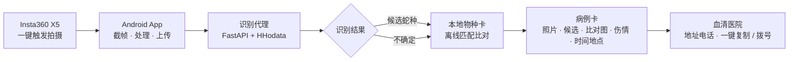

<div align="center">

# 一拍知蛇 · VenomLens

**拍下蛇 → 认出它 → 告诉医生该怎么救**

*一眼认蛇，分秒救命*

<sub>影石 Bold Maker 2026 智能影像挑战赛 · 赛道三（AI + 社会公益 · 公共健康）</sub>
<sub>队伍：两爬青年 ｜ 形态：Insta360 X5 + Android App</sub>

<sub>[简体中文](README.md) ｜ [English](README.en.md)（英文版更新滞后，以中文版为准）</sub>

</div>

---

## 本 README 怎么读

本项目**以路演目标为项目目标**。全文每一节都按两栏陈述，两者**互不替代**：

| 标记 | 含义 |
|---|---|
| **目标态** | 我们要做成什么——完整目标链路，项目的北极星 |
| **当前态** | 我们今天真实到达了哪里——逐项附证据，不含推测 |

> **医疗红线（读任何内容前先看）**
> - 候选与模型分值**不是物种确认、不是准确率**，不能排除危险，不能替代医疗判断。
> - 「未检测到蛇」**不等于现场安全**。
> - 本仓库不构成诊断、处置建议、血清用法或实时血清库存承诺。
> - **被咬伤：立即就医，把手机递给医生。不要等待识别或比对结果。**

---

## 1. 为什么做这件事

### 1.1 问题规模

| 指标 | 数值 | 口径 |
|---|---|---|
| 户外运动参与者 | **超 4 亿人** | 政府网，2025 |
| 年毒蛇咬伤 | **25–28 万例（估算）** | 中疾控区间 10–30 万，无全国监测系统 |
| 致残率 | **约 35%**（口播「约三分之一」） | 央广网；后遗症约 55.47% |
| 黄金 2 小时内送医 | **仅约三成** | 光明网 |

### 1.2 三个致命断点

真正决定后果的往往不是医疗技术本身，而是**信息**。

1. **伤者说不清是什么蛇。** 不同蛇毒处置方向不同（神经毒 vs 血液毒），用错处置反而致残。典型错误是照影视剧「绑住肢体阻止毒液回流」——过紧过久会阻断血流、造成缺血坏死，WHO 指出极端情况需截肢。
2. **认出来了也找不到血清。** 抗蛇毒血清国产仅 4 类（眼镜蛇 / 银环蛇 / 蝮蛇 / 五步蛇），全国仅一家企业生产，储备信息分散，伤者无从查起。
3. **民间俗称会骗人。** 「过山峰」在福建多指眼镜王蛇，在广西则泛指各类眼镜蛇——同一俗称在不同地区指向不同物种，靠口述几乎必然出错。

**硬约束**：被咬后伤者可能很快失去意识，**信息必须在意识清醒时采集完**。这是产品设计的起点。

### 1.3 两个真实触发

- **社会事件**：2026 年 7 月 6 日，广西南宁横州市云表镇邓圩村，一处无证违规养蛇场被洪水冲垮，约 **800–900 条蛇**涌入村民家中。60 岁村民陆翠连在家中被眼镜蛇咬伤颈、手，因断水断电、道路与信号中断，次日下午才送出就医，抢救无效死亡。
- **个人亲历**：2026 年 9 月 23 日，主讲人在比赛场地外打电话时，一条蛇从脚下窜过，事后只记得「一条黄花色的蛇」。

而蛇的外形，正是医生判断蛇种、选择血清**最关键的信息**。

---

## 2. 目标链路（北极星）



**设计原则**：**识别可以不确定，记录与求助不能被它卡住。** 认不准时仍按最可能的候选蛇给出已审核的参考应对信息，并强调尽快送医、以医生判断为准——**不会一句「不确定」就把人丢下**。

---

## 3. 目标态 vs 当前态（逐项对账）

核实时间：**2026-09-24**，方式：逐文件核对仓库与实测记录。

| 链路环节 | 目标态 | 当前态 | 状态 |
|---|---|---|---|
| **触发拍摄** | X5 机身快捷键一键触发，预录已缓存画面 | App 内按钮触发拍摄已通（已关闭自拍倒计时，按下即拍）。SDK 2.1.5 确有公开预录 API（`isPreRecording()` / `cancelPreRecord()` / `SubStatus.PRE_RECORDING` / `CtrlPreRecord`）与按键协议（`ButtonPressOptions` / `QButtonCustomActionInfo`），**但本项目尚未集成，机身按键回调未真机验证** | 部分 |
| **影像回传** | 按下之后全程自动：截图 → 处理 → 上传 → 识别 → 展示 | 四阶段自动编排代码已落地（`EmergencyFlow`：拍照 → 匹配相机相册 → SDK 自动下载 → 上传 → 识别 → 病例卡）；**但完整链路尚未真机连续走通一次** | 未闭环 |
| **物种识别** | 返回蛇种候选 + 不确定性 | **真实 HHodata 调用已通**（`class=R`，原始分值 `providerScore=97.02`，raw 响应已存档），真机实跑命中 | **已达成** |
| **毒性判断** | 有毒 / 无毒 + 毒型（神经毒 / 血液毒） | **未落地**。无语义分割模型，无独立毒性模型；物种卡 `riskStatus` 6 种**全部未标注** | 未落地 |
| **本地物种卡** | 中国区域最常见蛇类离线匹配，弱网兜底 | 机制真实：构建期注入 assets、sha256 内容级校验、路径白名单；**覆盖 6 种**（玉米蛇 / 加州王蛇 / 颈棱蛇 / 猪鼻蛇 / 赤链蛇 / 短尾蝮），其中 4 种有已发布卡图 | 部分 |
| **病例卡** | 照片 + 识别候选 + 比对图 + 毒型 + 伤情 + 时间地点 | 字段齐备（被咬 / 未被咬分支、咬伤时间、部位、症状、年龄、血型、位置、紧急联系人、比对选择、识别快照），带「本地伤情信息卡 · 非诊断」免责头；比对内容可显示；**毒型字段无数据可填** | 部分 |
| **血清医院** | 最近有血清医院地址电话，一键复制 / 一键拨号 | 消费端代码**全部就绪**（`HospitalDirectory`、剪贴板复制、`ACTION_DIAL` 拨号界面）；**`hospitals.json` 当前 0 条** | 未落地 |
| **一键导航** | 导航至最近医院 | **未做，已如实声明**（Q&A 标准回答：接入地图 SDK 需正式应用认证/签名，技术上完全可行，迫于时限未做） | 未做 |
| **实景准确率** | 野外真实抓拍样本的小样本评测 | **未验证**。现有 188 张素材来自受控场地，仅用于流程测试，不构成实景结论 | 未验证 |

> **这张表是本项目的核心资产之一**：它把「理想」「规划」「实现」三者的差距写在明面上，而不是让它在演示现场暴露。底稿 §12.2 红线明令禁止「录屏冒充实时、P 结果、剪辑冒充现场」——**宁可标注差距，不做伪装完成。**

---

## 4. 技术架构

### 4.1 三层

| 层 | 载体 | 职责 |
|---|---|---|
| 采集层 | **Insta360 X5**（Camera SDK 2.1.5） | 快捷键 / 按钮触发拍摄，输出影像（识别采用单镜头模式，远距离下全景单帧分辨率不足） |
| 处理层 | Android App + 推理服务 | 接收影像 → 截帧 → 去元数据 → 重编码 → 上传识别 → 交互流程 |
| 数据层 | 本地库 / 轻量代理 | 蛇类物种卡、血清医院信息、调用账本 |

### 4.2 识别三段式

```
① 语义分割   筛出「哪些画面里有蛇」        —— 未落地
② 物种识别   判出具体蛇种（HHodata class=R） —— 已通
③ 毒性判断   有毒/无毒 + 毒型              —— 未落地
```

识别服务**只给候选和不确定性**，不自动生成医疗诊断、血清用法或处置建议。

### 4.3 关键取舍（明确不做）

相机端 AI / 固件改造 · 录制中自动检测并主动弹窗 · 自训练分割与分类网络 · 医院系统对接 · 实时血清库存 · 自动诊断与用药 · 账户云病例 · 区域分布预警 · 离线识别（断网可看本地病例卡与医院资料，不等于支持离线 AI）。

---

## 5. 快速开始

### 5.1 推理代理与离线回归

```bash
python -m venv .venv && source .venv/Scripts/activate    # Python 3.12
python -m pip install -r inference/requirements.txt

# 离线回归：不产生任何供应商请求
RECOGNITION_MODE=mock LIVE_CALL_LIMIT=0 python -B -m unittest discover -s inference/tests
```

### 5.2 本机 mock 代理

```bash
RECOGNITION_MODE=mock LIVE_CALL_LIMIT=0 HHODATA_API_KEY= PROXY_TOKEN= \
  python -B -m uvicorn inference.app:app --host 127.0.0.1 --port 8765

curl --noproxy '*' http://127.0.0.1:8765/healthz
# 期望：mode=mock、localCallLimit=0、localCallsUsed=0
```

### 5.3 Android（真机 / 模拟器）

```bash
# 需求：Android 10+ / arm64-v8a / JDK 17 / compileSdk 35
export ANDROID_SERIAL="<adb devices 序列号>"
adb -s "$ANDROID_SERIAL" reverse tcp:8765 tcp:8765     # 真机经 USB 访问本机代理

"$GRADLE" :app:assembleDebug
"$GRADLE" :app:connectedDebugAndroidTest \
  -Pandroid.testInstrumentationRunnerArguments.mockProxyUrl=http://127.0.0.1:8765
```

> 不传 `mockProxyUrl` 时，外部 HTTP 集成测试**跳过而非记为通过**。
> 手机连相机热点时无外网，经 `adb reverse` 走 USB 访问本机代理。

### 5.4 三种运行模式

| 模式 | 开关 | 说明 |
|---|---|---|
| `mock`（默认） | `RECOGNITION_MODE=mock`，`LIVE_CALL_LIMIT=0` | 7 组固定响应驱动，零额度联调，客户端显著标注 |
| `live`（真实） | `RECOGNITION_MODE=live` + `HHODATA_API_KEY` + `PROXY_TOKEN` | 真实外发先占持久化预算；密钥只走进程环境变量 |
| `演示 lane`（**已作废**） | ~~`DEMO_RELEASE_UNVERIFIED=1`~~ | 2026-09-24 起映射准入改为「在本地目录内」，未核验名称恒可映射且逐条披露（`demoRelease` / `nameStatus`），该开关与 `/healthz` 的 `demoReleaseUnverified` 一并移除。见契约附则 B |

---

## 6. 关键工程决策

1. **Mock-first 并行开发。** 契约与 7 组固定响应先冻结（9/22 17:00），Android 与推理两侧不互相等待。真实外发额度仅 30–50 次，因此默认预算 0。
2. **预算账本保护。** SQLite 持久化账本（`LIVE_CALL_LIMIT` 0–50，重启不清零）；所有外发尝试先占预算；同图去重命中回放 `resultSource=cache`；失败与超时不退款。
3. **本地物种卡离线匹配。** 识别结果（物种 ID）一返回即离线匹配已审核物种卡，无需再联网拉详情——把应对信息以最快速度呈现，弱网也不耽误救治时间。
4. **内容四项独立审核。** 物种卡的名称 / 文案 / 图片 / 来源**四项独立门禁**，`reviewStatus + reviewedBy + reviewedAt` 齐备才放行正常投影；被拦截的图片数用 `hiddenImageCount` 明示，**不伪装**。宁缺毋假。
5. **发布图合规管线。** 去 GPS / EXIF、最大边 1280px、JPEG q85、仅 `data/card_images/` 下的 `.jpg`、输出目录必须为空、sha256 双向印证、来源权利链闭合。
6. **降级不伪装完成。** 任何降级（App 按钮替代机身按键、素材导入替代实时拍摄）都必须如实标注与原目标的差距，**不许把模拟结果、旧结果或导入素材冒充当次真实识别**。
7. **只保留必要的数据与权限。** 上传同意与定位同意分开；拒绝上传后仍可记录伤情并查看本地医院；原图、伤情、位置默认留在手机。

---

## 7. 数据与合规口径

### 7.1 四类结论互不替代

引用任何结论时，**必须注明属于哪一类**：

| 口径 | 含义 |
|---|---|
| **模拟通过** | mock fixtures / 离线测试通过 |
| **编码符合本地规范** | 契约、审核门禁、发布管线约束被测试固定 |
| **供应商实测通过** | 真实 HHodata 调用取得响应，raw 存档 |
| **实景效果已验证** | 真实抓拍样本的小样本评测 —— **本项目尚未达到此类** |

### 7.2 数据归属

| 素材 | 权利 | 状态 |
|---|---|---|
| 玉米蛇 01、猪鼻蛇 02 | 团队自主拍摄（2026-09-19 调研） | 来源闭合，可发布 |
| 7 张网络图（iNaturalist CC） | CC 许可 | 文件-作者绑定未闭合，**暂不发布** |
| 颈棱蛇 01/02 | 旧观察页已指向其他物种 | **禁止按旧链接署名发布** |

> **有署名 ≠ 审核通过 ≠ 独立验证了授权或物种。**

### 7.3 安全

- 密钥只进进程环境变量，不写入 APK / Git / 日志 / 视频；`PROXY_TOKEN` ≥16 字符且不复用供应商密钥。
- 客户端只连团队代理，**APK 内不保存供应商密钥**。
- 代理不落盘图片、不记录完整请求体；上传前必须取得图片外发同意（`uploadConsent=true`）。

---

## 8. 测试

**最近一次全绿基线**（离线，零真实调用）：

| 侧 | 数量 | 覆盖 |
|---|---|---|
| 推理代理（Python / unittest） | **73 项** | 代理行为、预算保护、同图去重、7 场景状态码、映射准入、中文展示校验、审核投影、发布图约束、目录外名称兜底 |
| Android JVM | **92 项** | 识别 JSON 解析、HTTP Adapter、病例卡、医院目录、物种目录、急救流程状态机与授权闸门 |
| Android 仪器测试 | **50 项** | HTTP 7 场景、pending 手动查询、病例部分提交恢复、医院安全拨号 Intent、物种比对页 |

均为模拟器 / 模拟数据验证，**不等于真机相机与真实识别验收**。

---

## 9. 已知缺口（诚实清单）

| # | 缺口 | 说明 |
|---|---|---|
| 1 | **端到端真机闭环未验证** | 各分段均有证据，唯独「相机 → 病例卡 → 医院」完整一次未连续跑通 |
| 2 | **血清医院数据为空** | `hospitals.json` 当前 0 条；消费端代码就绪，只差数据接入 |
| 3 | **毒性判断未落地** | 物种卡 `riskStatus` 6 种全部未标注 |
| 4 | **预录 / 机身快捷键未集成** | SDK 具备公开 API（集成缺失，非能力不可行） |
| 5 | **语义分割未落地** | 三段式中的第 ① 段 |
| 6 | **物种卡覆盖薄** | 6 种，其中 3 种未完成文案审核；演示用玉米蛇卡片完整 |
| 7 | **实景准确率未验证** | 现有素材为受控场地拍摄，仅测流程 |
| 8 | **一键导航未做** | 已如实声明 |
| 9 | **供应商计费细则与图片留存政策未核实** | 需向供应商确认，不作永久结论 |
| 10 | **7 张网络图来源未闭合** | 未闭合者不发布 |

---

## 10. 路线图：从当前态到目标态

按「离目标差多远」排序，而非按功能多少排序。

**P0 — 不做则目标链路不成立**

1. 修复 Android 工作树编译断点，恢复可出包状态
2. 接入真实血清医院数据（哪怕先做演示城市若干家，**电话必须真实可拨**）
3. 补齐演示物种的 `riskStatus` 人工标注并留痕（标注人 / 时间 / 来源）
4. **完整真机端到端跑通一次并录屏取证**，实测耗时口径
5. 出口径收敛：预录 / 快捷键如实降格，毒型与医院按实际数据陈述

**P1 — 让目标态更完整**

6. 接入 SDK 预录分支（`onCaptureSubStatusChanged` → `PRE_RECORDING` 触发保存 → 识别链路）与机身快捷键配置
7. 扩充物种卡覆盖（中国区域常见蛇类），打通名称 / 文案 / 图片 / 来源审核流水线
8. 收集有许可、可信标签的野外样本，做第一轮实景评测

**P2 — 收尾卫生**

9. 统一测试数字口径与文档回写闭环（实现变更 → 文档同步）
10. 网络图来源闭合；供应商计费与留存政策核实

---

## 11. 团队

| 成员 | 分工 |
|---|---|
| **舒豪杰** | 队长 / 设计 · 主讲 · 用户调研 · 蛇类领域知识 |
| **韦仕学** | Android 客户端 · Insta360 相机链路 · 病例卡 / 医院目录 / 物种比对 |
| **郭浩天** | AI 模型接入与部署 · 识别代理 · 物种卡数据与审核管线 · 测试 |

> 团队由爬宠行业一线从业者与工程开发者组成：队长为爬宠博主，具备蛇类专业认知与行业专家资源；队伍具备「硬件采集 + Android 客户端 + AI 推理」的完整闭环能力。

---

## 12. 目录结构

```text
android/snakesnap/            Android 业务 App（Insta360 SDK Demo 改造）
  .../demo/ui/emergency/      一键急救主线（拍照 → 自动下载 → 识别 → 病例卡 / 医院）
  .../demo/recognition/       识别 Adapter（真实 HTTP / Mock）与契约模型
  .../demo/care/              病例信息卡（本地存储，noBackupFilesDir）
  .../demo/hospital/          医院目录（离线校验、复制、系统拨号界面）
  .../demo/species/           物种比对页（消费 data/species-cards.json）
inference/                    FastAPI 识别代理 + HHodata Adapter + 预算账本
  cards.py                    物种卡审核投影（normal / preview）与发布包导出
  card_preview/               纯前端离线演示页（7 种 mock 场景、审核开关）
  tests/                      72 项离线测试（unittest，无 pytest 依赖）
contracts/                    识别通信契约（唯一 Interface）+ 7 组 fixtures
data/species.json             物种卡数据源（v2 schema，四项独立审核状态）
data/species-cards.json       客户端投影产物
data/card_images/             发布图管线产物（去 GPS、≤1280px、q85）
data/reference_images/        策展参考图原档（不打包发布）
docs/handoff/                 交接文档与实测记录
docs/archive/                 历史版本归档
```

---

## 13. 声明与许可

- 代码与文档：参赛作品 © **两爬青年**（2026）。Insta360 SDK 版权归属其权利人。
- 图片：团队实拍为团队自有；网络图按各自 CC 许可（作者与来源见 `data/species.json`），**未闭合者不发布**。
- 物种命名参考：iNaturalist taxa 页、The Reptile Database；科普文案注明来源，**未经人工审核不进入正常投影**。
- **本仓库任何内容不构成医疗建议。疑似蛇咬伤请立即联系急救并就医。**

<div align="center">
<sub>成功的定义不是识别准确率有多高，<br/>而是能不能让一例蛇伤更快地被正确处置。</sub>
</div>
