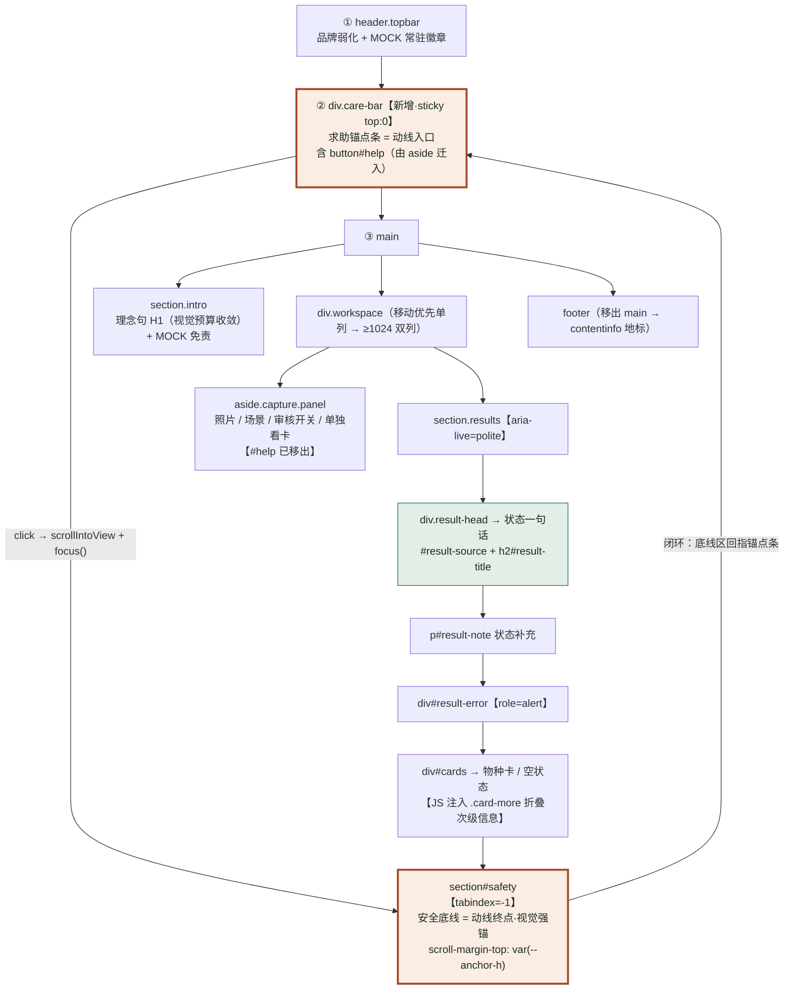
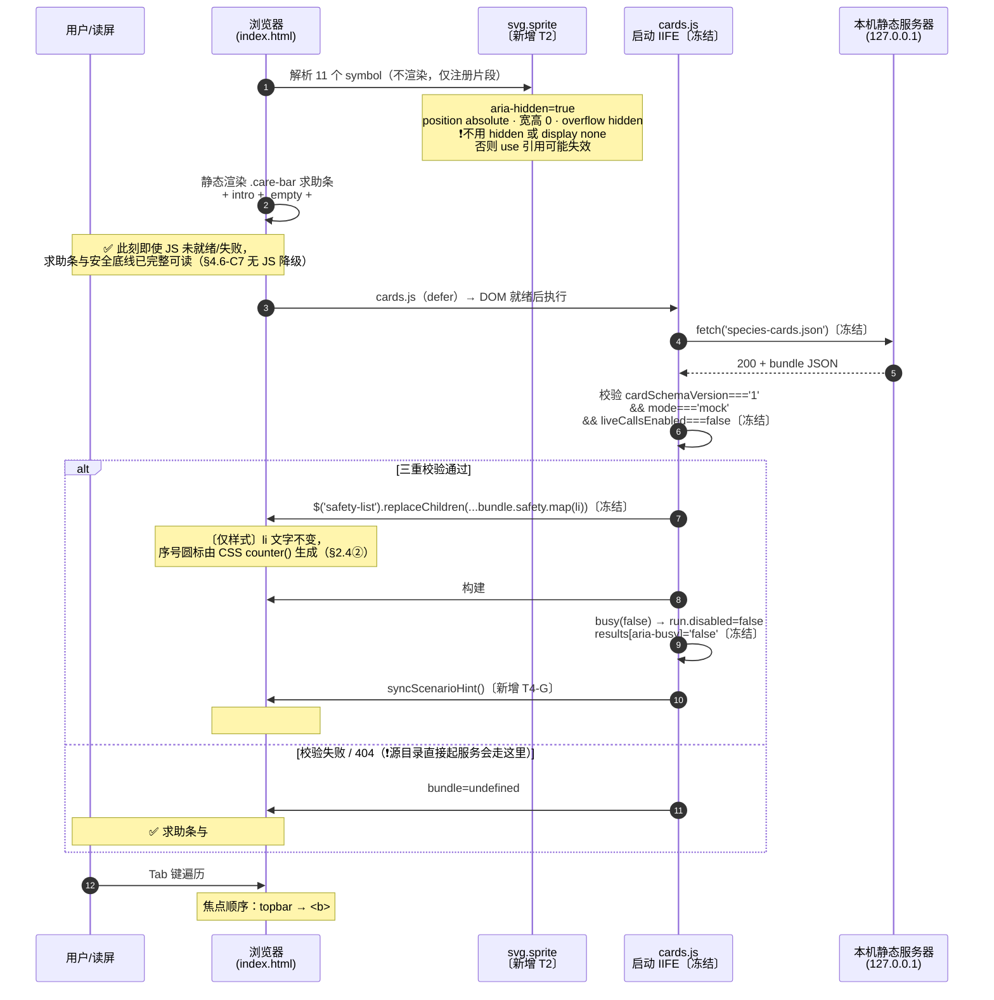
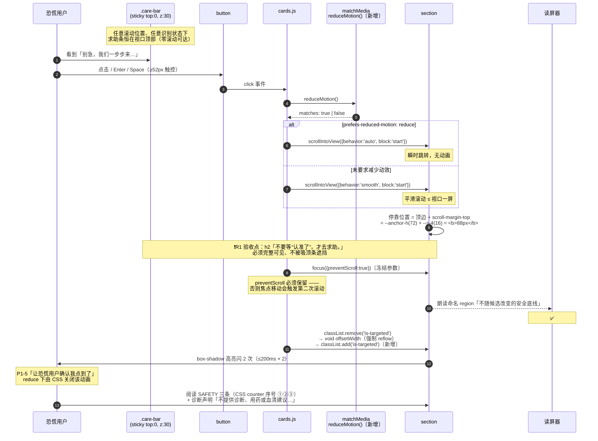
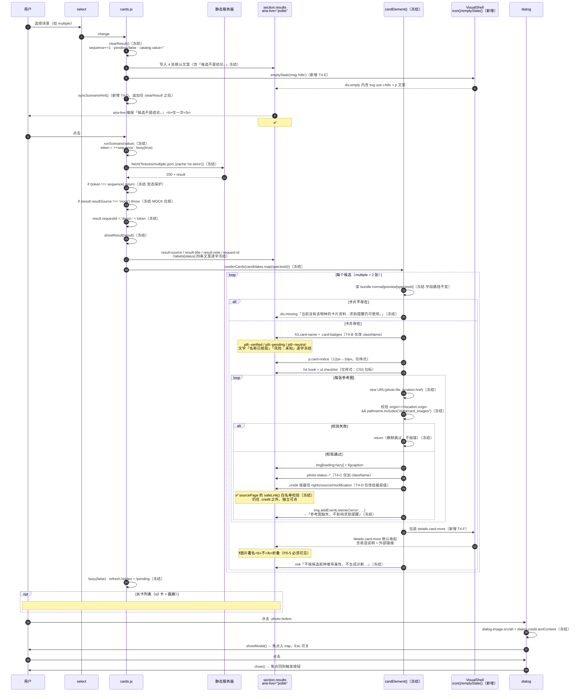
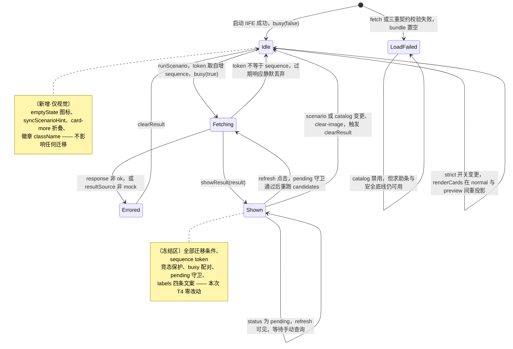
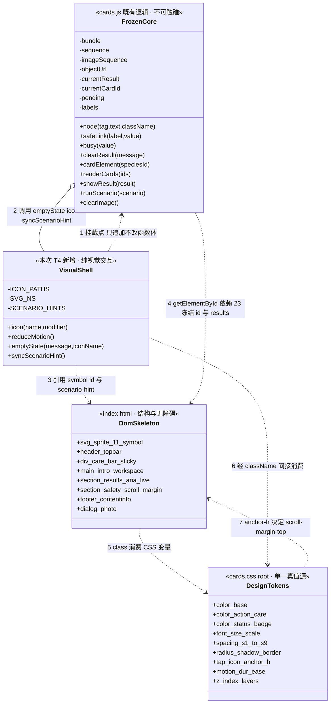
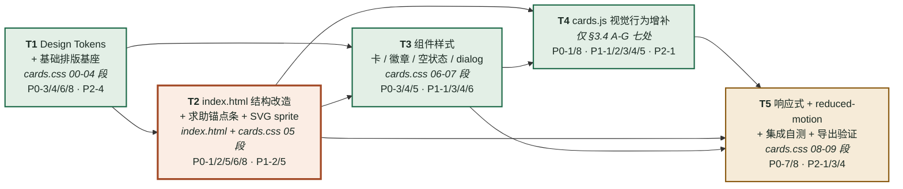

# VenomLens 一拍知蛇 · card_preview UI 公益化重设计 — 架构设计与任务分解

> 文档类型：增量架构设计（#3）
> 架构师：高见远
> 上游输入：`docs/ui-prd-card-preview.md`（PM 许清楚，#2）
> 下游承接：工程师寇豆码（#4 实现）→ QA（#5 回归）
> 重设计对象：`inference/card_preview/`（`index.html` + `cards.css` + `cards.js`）
> 基线 commit：`bcfb501`；基线测试：`test_cards.py` + `test_display_zh.py` 共 **16/16 全绿**（本文撰写时实测）
> 语言：中文（与原始需求一致）

---

## 0. 决策基线（team-lead 已拍板，本文直接采纳）

| # | 决策 | 落地方式 |
|---|---|---|
| Q1 | 配色 = **候选 A「晨雾浅色安抚系」**，本次**单主题**，不做深色切换 | `:root` 全量 token 替换，`color-scheme:light`；见 §2.2 |
| Q2 | 求助锚点条 **sticky 吸顶**；`#safety` 配 `scroll-margin-top`；移动端锚点条总高 **≤72px** | `.care-bar{position:sticky;top:0}`；`--anchor-h` 单一真值；见 §2.4① / §4.2 |
| Q3 | 合规文案**语义逐字保留**，只调排版与字号层级；引导/空状态/错误可软化，不得新增医疗建议、不得出现"安全/没毒"暗示 | 冻结清单见 §1.5；可软化清单见 §1.6 |
| Q4 | 图标统一**极简线性内联 SVG**（`stroke:currentColor`，单色随 token）；禁蛇/骷髅/警告三角/emoji | SVG sprite + 图标规格见 §2.6；JS 侧见 §3.3 |
| Q5 | 双主题不做（P2-2 搁置） | token 已按可换肤方式组织，留 Android 阶段回灌 |
| Q6 | H1 允许微调突出救助气质，"候选不是结论"语义必须保留 | **默认不改 H1**（原文已满足全部 P0）；可选文案见 §1.6-C，需 team-lead 点头 |
| Q7 | **不得新增任何独立资源文件**；三文件结构不变 | 图标全部内联；`export_bundle` 白名单实测确认，见 §4.1 |

**一句话架构方针**：`DOM 动线重排 + token 全量替换 + JS 只做"视觉外壳"增补`，功能骨架与数据契约零改动。

---

## 目录

| 章节 | 内容 | 主要读者 |
|---|---|---|
| **Part A · 系统架构** | | |
| §1 设计方案总述 | 现状诊断 D1–D3、新信息动线 → DOM 映射、结构变更图、节点变更明细表、**§1.5 冻结清单**、§1.6 可软化清单 | 全体 · **工程师必读 §1.5** |
| §2 CSS 架构 | 文件 9 段组织、**§2.2 Design Tokens + 实测对比度表**、§2.3 移动优先断点、§2.4 九个组件规格、§2.5 无障碍样式层、§2.6 内联 SVG 图标系统（11 个 symbol 含 path） | 工程师（T1/T2/T3） |
| §3 cards.js 变更范围 | §3.1 可改穷举、**§3.2 不可触碰清单**、§3.3 新增函数规格、**§3.4 修改点 A–H 逐条（T4 工作清单）**、§3.5 禁止模式 | 工程师（T4）· **动手前必读 §3.2** |
| §4 风险与兼容 | §4.1 Python 测试与 export_bundle 影响（含实测）、**§4.2 sticky × aria-live × scroll-margin（最高风险 R1–R6）**、§4.3 长卡下求助可达性 L1–L5、**§4.4 Windows 中文路径调试循环（可照抄）**、§4.5 CSP 红线、§4.6 兼容性 C1–C8 | 工程师 · QA |
| §5 程序调用流程 | 时序①初始化 / **时序②求助锚点跳转** / 时序③场景识别→渲染→放大 / §5.4 状态机语义边界图 | 工程师 · QA |
| **Part B · 任务分解** | | |
| §6 数据结构与职责边界 | `FrozenCore` / `VisualShell` / `DesignTokens` / `DomSkeleton` 四单元类图 + 7 条依赖关系的改动波及面 | 工程师 |
| §7 Required Packages | **无**（0 新增依赖） | team-lead |
| **§8 任务列表 T1–T5** | 每任务：源文件 / 依赖 / 优先级 / PRD 需求 ID 映射 / 工作内容 / 验收标准 | **工程师主入口** |
| §9 Shared Knowledge | 14 条跨任务全局纪律（含"改越界"的量化判据） | 工程师 |
| §10 任务依赖图 | 关键路径 T1→T2→T3→T4→T5 + 并行机会分析 | team-lead · 工程师 |
| **Part C · 验收与遗留** | | |
| §11 验收核对表 | **22 项**（PRD §7 原 10 项 + 架构级补充 12 项），逐项含验证方法与责任任务 | QA（#5） |
| §12 Anything UNCLEAR | U1–U9 假设与待确认项（含需 team-lead / PM 拍板的 4 项） | team-lead · PM |
| 附录 A | 现状 → 目标 12 维度快速对照 | 全体 |
| 附录 B | 上游文档索引 | 全体 |

### 工程师 30 秒速读

1. **三文件不许增**：`inference/card_preview/` 永远恰好 3 个文件，图标全部内联（`cards.py:105-106` 白名单硬编码）。
2. **CSP 无 `unsafe-inline`**：禁 `style=` 属性、禁 `<style>`、禁 `el.style.x=`、禁 `innerHTML`、禁 `data:` URI。所有视觉变化只能落在 `cards.css` 的类选择器上。
3. **改 `cards.js` 前先读 §3.2**，只允许 §3.4 的 A–G 七处。判据：`git diff` 删除行数 ≤10 行；>30 行 = 改越界，回退重做。
4. **23 个 id + `.results` class 是隐性硬依赖**（§1.5-A），改一个就 TypeError 白屏。
5. **合规文案一律不改字**（§1.5-B）。软化 = 在后面追加，不是替换。判断口诀：**"这句话在改变用户对风险的认知吗？"** 是 = 冻结。
6. **调试别在源目录起服务器**（没有 `species-cards.json` 和 `fixtures/`，会 404 且这是预期行为）。用 §4.4 的循环：导出到 `%TEMP%`，之后只 `cp` 三个文件。
7. **测试命令用显式点分名**：`python -B -m unittest inference.tests.test_cards inference.tests.test_display_zh`（`discover` 在本仓库报 ImportError）。基线 **16/16 全绿**。
8. **别动 `android/`**（另一位工程师并行施工中）。

---

# Part A · 系统架构

## 1. 设计方案总述

### 1.1 现状诊断（3 个结构性问题）

| # | 问题 | 现状证据 | 后果 |
|---|---|---|---|
| **D1** | **求助入口被埋在操作面板最底部** | `index.html:25` — `<button id="help">` 位于 `aside.capture` 内、`details.catalog-picker` 之后，是侧栏最后一个元素 | 恐慌用户必须先"看完整块操作面板"才能发现求助入口；移动端（≤660px 单列）它被压到首屏之外，**违背 US-2** |
| **D2** | **安全底线在结果列最末尾，且视觉权重最弱** | `index.html:32` — `#safety` 是 `.results` 最后一个子节点；CSS `.safety{border:1px solid #73543b;background:#2e2a1f}`，与深色页面底 `#101e1a` 明度接近 | 多候选场景（`multiple` 渲染 2 张卡 + 画廊）会把 `#safety` 推出视口；深色底上暖褐色块**不构成视觉锚** |
| **D3** | **柠檬绿承载了过多语义，气质偏"科技/酸性"** | CSS `--lime:#d2f56a` 同时用于：`.primary` 按钮底、`.eyebrow` 文字、`:focus-visible` 焦点环、`.image-picker span` 加号、`.pill.lime` MOCK 徽章底、`.switch accent-color` | 品牌色 = 行动色 = 焦点色 = 徽章色，**层级坍塌**；且 `--lime` 上文字 `#18372c` 虽对比达标（10.5:1），但整页观感与"安抚恐慌用户"相悖（PRD §5.2 去酸性） |

> 附带问题（非结构性，一并修）：桌面优先断点（`1350/920/660`）；正文 `15px` 低于 P0-4 要求；`.help-button{font-size:13px}` 与"最高优先级"定位矛盾；`.text-button` / `.request-id` / `footer` 使用 10–12px 小字承载合规信息（PRD §5.3 禁止）。

### 1.2 新信息动线 → DOM 映射

PRD §5.1 的动线「**求助 → 状态 → 卡片 → 底线**」映射为一条**线性可达链**，其中首尾两端（求助锚点条 / 安全底线）通过 sticky + 锚点跳转形成**闭环**：



**三条设计原则落到 DOM**：

| 原则 | DOM 手段 |
|---|---|
| **急救优先**（Calm-first） | `#help` 从 `aside` 迁到 `body > div.care-bar`，`position:sticky; top:0`，`z-index:30`。**任意滚动位置、任意识别状态下零滚动可达**（P0-1） |
| **降认知负载**（Low-load） | `.results` 内严格保持 `状态 → 卡片 → 错误` 的 DOM 顺序即视觉顺序；卡内次级信息（易混/外链/署名）由 JS 包进 `details.card-more` 默认收起（P1-3），一屏只留"蛇名 + 徽章 + notice + hook + checklist + 画廊" |
| **公益关爱气质**（Caring） | `--care`（暖陶土）专属求助与安全底线；`--action`（深松绿）专属主行动；`--lime` 降级为 ≤3 处小面积点缀（P0-3） |

### 1.3 index.html 结构变更图（before → after）

```
【现状 · 39 行】                                  【目标结构】
body                                              body
├─ header.topbar                                  ├─ svg.sprite【新增·hidden aria-hidden】11 个 symbol
│  ├─ a.brand > span                              ├─ header.topbar
│  └─ span.pill.lime            ──────┐            │  ├─ a.brand > span
├─ main                               │            │  └─ span.pill.pill--mock   ◄── class 改名（文字冻结）
│  ├─ section.intro                   │           ├─ div.care-bar【新增·sticky】◄──────┐
│  │  ├─ div > p.eyebrow + h1         │           │  ├─ svg.icon use(#i-heart)          │
│  │  └─ p.intro-note                 │           │  ├─ p.care-bar__lead【新增文案】     │
│  ├─ div.workspace                   │           │  └─ button#help                     │
│  │  ├─ aside.capture.panel          │           │      ▲ 从 aside 迁入，文案软化       │
│  │  │  ├─ div.section-title         │           ├─ main                               │
│  │  │  ├─ label.image-picker        │           │  ├─ section.intro（结构不变）        │
│  │  │  ├─ input#image-input         │           │  ├─ div.workspace（结构不变）        │
│  │  │  ├─ p#image-info              │           │  │  ├─ aside.capture.panel          │
│  │  │  ├─ button#clear-image        │           │  │  │  ├─ …（不变）                  │
│  │  │  ├─ div.separator             │           │  │  │  ├─ p#scenario-hint【新增】    │
│  │  │  ├─ label + select#scenario   │           │  │  │  ├─ button#run / #refresh     │
│  │  │  ├─ button#run / #refresh     │           │  │  │  ├─ label.switch + p.muted    │
│  │  │  ├─ label.switch + p.muted    │           │  │  │  └─ details.catalog-picker    │
│  │  │  ├─ details.catalog-picker    │           │  │  │      ✗ button#help 已移出 ─────┘
│  │  │  └─ button#help  ◄────────────┘ 删除     │  │  └─ section.results
│  │  └─ section.results                        │  │     ├─ div.result-head
│  │     ├─ div.result-head                      │  │     │   └─ p#result-echo【新增·aria-hidden】
│  │     ├─ p#result-note                        │  │     ├─ p#result-note
│  │     ├─ div#result-error                     │  │     ├─ div#result-error
│  │     ├─ div#cards > div.empty                │  │     ├─ div#cards > div.empty
│  │     └─ section#safety                       │  │     │   └─ svg.icon use(#i-hills)【新增】
│  │        ├─ p.eyebrow                         │  │     └─ section#safety
│  │        ├─ h2                                │  │        ├─ div.safety-inner【新增·包裹层】
│  │        ├─ ul#safety-list > li×3             │  │        │  ├─ p.eyebrow
│  │        └─ p（诊断声明）                      │  │        │  ├─ h2#safety-title【新增 id】
│  └─ footer  ◄──── 移出 main                    │  │        │  ├─ ul#safety-list > li×3
└─ dialog#photo-dialog                            │  │        │  └─ p（诊断声明）
                                                  │  │        └─ ✗（无新增回指按钮，见 §4.3）
                                                  └─ footer【移出 main → contentinfo 地标】
                                                  └─ dialog#photo-dialog（结构不变）
```

**变更量统计**：新增节点 **5 处**（sprite / care-bar / #scenario-hint / #result-echo / .safety-inner / .empty 内 icon）；迁移节点 **2 处**（`#help`、`footer`）；改名 class **1 处**（`.pill.lime` → `.pill--mock`）；新增 id **2 个**（`safety-title`、`result-echo`、`scenario-hint` — 共 3 个）。**删除节点 0 个**（`#help` 是迁移不是删除）。

### 1.4 节点变更明细表

| 节点 | 操作 | 新增/变更属性 | 理由 · PRD ID |
|---|---|---|---|
| `svg.sprite` | **新增**，紧随 `<body>` | `aria-hidden="true" focusable="false"`；含 11 个 `<symbol id="i-*" viewBox="0 0 24 24">`。⚠️ **不加 `hidden` 属性** — 用 `.sprite{position:absolute;width:0;height:0;overflow:hidden}` 隐藏（`display:none` 会让部分浏览器的 `<use>` 引用失效，见 §2.6 末） | 图标内联、零请求（P0-6 / Q4）；见 §2.6 |
| `header.topbar` | 保留 | 加 `role="banner"`（显式化） | 地标导航 |
| `.pill.lime` | **class 改名** → `.pill.pill--mock` | — | 文字 `本机离线演示 · MOCK` **逐字冻结**（Q3）；配色改 `--mock` 深底白字（P0-5 / §5.4④） |
| `div.care-bar` | **新增** | `role="region" aria-labelledby="care-bar-title"`；`id="care-bar-title"` 落在 `.care-bar__lead` 上（视觉隐藏前缀"紧急求助"可置于 `<span class="sr-only">`） | 成为可被地标导航直达的区域（P0-1 / US-2） |
| `button#help` | **迁移**：`aside.capture` 末位 → `div.care-bar` 内 | `class` 由 `help-button` → `care-bar__cta`；**保留 `id="help"` 与 `type="button"`** | `cards.js:240` 用 `$('help')` 取节点，id 必须保留；class 可自由改（§3.1） |
| `aside.capture` | 保留 | 删除最后一个子节点 `#help` 后，`details.catalog-picker` 成为末位 | D1 修复 |
| `p#scenario-hint` | **新增**，紧跟 `select#scenario` | `class="hint"`；`aria-live="polite"`；初始文案 + `data-*` 场景说明由 JS 更新 | P1-2「加一行微说明当前选择意味着什么（仍标注 MOCK）」 |
| `section.results` | 保留 | `aria-live="polite" aria-busy="false"` **原样保留**；可选加 `aria-labelledby="result-title"` | P0-8；`cards.js:32` 依赖 `.results` 选择器（见 §3.2 冻结项） |
| `p#result-echo` | **新增**，置于 `.result-head` 内、`#result-title` 之后 | `aria-hidden="true"`；`class="result-echo"` | 求助引导**视觉**常驻结果区，但**不进 aria-live 播报流**，避免每次状态变化重复朗读（§4.2 风险 R3 的解法） |
| `div#cards > div.empty` | 保留容器，内容由 JS 重建 | 静态首屏空状态可加 `<svg class="icon"><use href="#i-hills"/></svg>` | P1-1 平静视觉锚（Q4：远山，禁蛇） |
| `section#safety` | 保留 + **内部加包裹层** | `id`/`tabindex="-1"` **不变**；新增 `aria-labelledby="safety-title"`；新增子节点 `div.safety-inner` 承载 padding/border | `scroll-margin-top` 落在**无 padding 的 `#safety`** 上，定位精确（§4.2）；命名后 `<section>` 升级为 `region` 地标 |
| `h2`（safety 标题） | 保留 | 新增 `id="safety-title"` | 供 `aria-labelledby` 引用 |
| `ul#safety-list` | **完全冻结** | 无 | `cards.js:249` 用 `replaceChildren` 从 `bundle.safety` 全量重建；三条文案源自 `cards.py:13-17 SAFETY` |
| `footer` | **迁移**：`main` 内 → `main` 之后（`body` 直接子节点） | 加 `role="contentinfo"`（移出 main 后自动成为该地标，显式写更稳） | 语义正确性；无 JS 引用，零风险 |
| `dialog#photo-dialog` | 保留 | 关闭按钮 class `secondary` → `secondary dialog-close`（保留 `secondary` 以继承基础样式） | P1-6：关闭按钮 ≥44px |
| CSP `<meta>` | **完全冻结** | 无 | `default-src 'self'; script-src 'self'; style-src 'self'` — **无 `unsafe-inline`**，见 §4.5 |

### 1.5 🧊 冻结清单（工程师不得改动，逐字/逐项）

**A. `id` 与 JS 依赖的选择器（改一个就白屏或功能断裂）**

`image-input` `input-preview` `image-placeholder` `image-info` `clear-image` `scenario` `run` `refresh` `strict` `catalog` **`help`** `result-source` `result-title` `result-note` `result-error` `cards` `request-id` **`safety`** **`safety-list`** `photo-dialog` `dialog-image` `dialog-credit` `close-dialog`
外加一个 **class 选择器**：`.results` —— `cards.js:32` 用 `document.querySelector('.results')` 设置 `aria-busy`。**`.results` 这个 class 名不得改。**

**B. 合规文案（语义逐字保留，只可调排版/字号/层级 — Q3）**

| 文案 | 载体 | 是否可改字 |
|---|---|---|
| `本机离线演示 · MOCK` | `.pill--mock` | ❌ 逐字冻结 |
| `候选不是结论。` | `cards.js:44` `clearResult()` 默认 `result-title` | ❌ 逐字冻结（Q6 明确要求） |
| `未检测到蛇，不代表现场安全` | `cards.js:10` `labels.no_snake` | ❌ 逐字冻结 |
| `候选蛇种，不代表已确认` / `仍有不确定性，请保留原图` / `识别处理中，由你决定是否查询` | `cards.js:10` `labels` | ❌ 逐字冻结 |
| `识别没有完成，求助入口仍在。` | `cards.js:135` | ❌ 逐字冻结（可在其**后**追加软化句，见 §1.6-B） |
| `风险：未知` | `cards.js:64` | ❌ 逐字冻结 |
| `名称已核验`/`名称待核验`/`文案已审核`/`文案待审核`/`文案未整理` | `cards.js:62-63` | ❌ 逐字冻结（class 可改，见 §3.4） |
| `演示草稿 · 非实际辨认依据` | `cards.js:59` | ❌ 逐字冻结 |
| `参考图已审核` / `参考图待人工核验 · 仅演示` | `cards.js:99` | ❌ 逐字冻结 |
| `不按候选蛇种推导毒性，不生成诊断、用药或处置方案。` | `cards.js:122` `.risk` | ❌ 逐字冻结 |
| `不提供诊断、用药或血清建议；本演示不提供医院实时库存。` | `index.html:32` `#safety` 末段 | ❌ 逐字冻结 |
| `不随候选改变的安全底线` / `不要等“认准了”，才去求助。` | `index.html:32` `#safety` eyebrow + h2 | ❌ 逐字冻结 |
| `SAFETY` 三条 | `cards.py:13-17` → `bundle.safety` → `#safety-list` | ❌ **数据源冻结**，前端不得改写、增删、重排 |
| 图片署名 `rights` / `source` / `modification` / `sourcePage` | `cards.js:90,94,100-104` | ❌ 字段与拼接串冻结（`credit` 的 `＋ '；' ＋` 拼接格式不变）；**排版可改**（P0-5 允许做成统一小字块） |
| `名称核验 ≠ 文案审核 ≠ 照片核验　·　参考照片不代表所有年龄、地区或宠物品系的外观。` / `卡片数据与识别响应分离，Android 可按 speciesId 接入；本页不是 Android 真机验收证据。` | `index.html:35` `footer` | ❌ 逐字冻结 |
| `以下为固定模拟响应与物种卡设计预览，不是对所选照片的真实识别。照片只在当前浏览器显示，不上传、不保存，不产生模型调用。` | `index.html:14` `.intro-note` | ❌ 逐字冻结（含 `<strong>` 位置） |
| `看见候选，也看见不确定。` | `index.html:14` `.eyebrow` | ❌ 冻结（这是首屏的不确定性锚） |

**C. 结构与契约**
- 文件数量与文件名：`index.html` / `cards.css` / `cards.js` **恰好三个**，不增不减不改名（`cards.py:105-106` 白名单 + `test_cards.py:122-135`）。
- `species-cards.json` 字段读取路径（`cards.js:50,57,59,62-65,69,72-74,90-104,110-119,248-256`）全部不变。
- CSP `<meta>` 内容不变（`index.html:6`）。
- `<link rel="stylesheet" href="cards.css">` 与 `<script src="cards.js" defer>` 不变（`defer` 必须保留，否则 `$('run')` 等在 DOM 就绪前执行会抛错）。

### 1.6 ✏️ 可软化清单（PM 授权范围内，附建议文案）

**A. 新增元素的文案（本次新写，无历史包袱）**

| 元素 | 建议文案 | 合规检查 |
|---|---|---|
| `.care-bar__lead` | `别急，我们一步步来。下面的提醒不随识别结果改变，随时可看。` | ✅ 无医疗建议、无"安全/没毒"暗示；"不随识别结果改变"复述 `#safety` eyebrow 语义 |
| `button#help`（原 `已被咬伤？查看通用求助提醒`） | `已被咬伤？查看求助提醒` | ✅ 保留"已被咬伤"条件句 + "求助提醒"指向；仅去掉"通用"二字以避免与新增 lead 重复。**若 team-lead 倾向零风险，保留原文亦可**（长度在移动端仍可容纳，见 §2.4①） |
| `p#result-echo` | `随时可查看下方的求助提醒` | ✅ 纯导航提示 |
| `#scenario-hint` 初始 | `当前为模拟场景（MOCK），不会调用识别模型。` | ✅ 复述 MOCK 语义 |
| `.empty` 引导（首屏静态） | 保留原 `01 / 选择照片或场景` + `原图、参考图与不确定性，在同一屏被看见。` + `物种名称、说明文案和照片分别审核。未经审核的内容只用于带标记的演示。`，**在其后追加**：`不选照片也能演示；求助提醒随时可看。` | ✅ 追加句 = P1-1 要求的安抚引导，不替换任何合规句 |

**B. 已有"报错口吻"文案的软化方式 = 追加而非替换**

`cards.js:135-136` 与 `cards.js:171`、`cards.js:261` 的错误文案属 Q3 允许软化范围，但**风险/收益不划算**：这些字符串是 JS 逻辑的一部分，改动会扩大 diff 且需重新逐条合规比对。

> **架构决策：本次一律不改 JS 内既有文案字符串。** 软化通过 **CSS 呈现层**完成——`#result-error` 由"报警红块"改为 `--danger-soft` 平静提示条 + `#i-info` 图标（而非警告三角），并在其后由 HTML 静态承载 `.care-bar` 常驻求助。若 PM 坚持追加软化句，仅允许在 `index.html` 的静态节点上追加，不动 JS 字符串。

**C. 可选：H1 微调（Q6 授权，默认不执行）**

- 现状：`不止知道名字，<br>把照片放在一起看。`
- 提案（**需 team-lead 确认后由工程师在 T2 执行**）：`先知道该做什么，<br>再看清是什么蛇。`
- 理由：直接把 P0-2 的信息动线写进首屏理念句，5 秒内让评委 get 到"救助工具而非识别玩具"（US-5）。
- 安全性：不含任何"安全/无毒"暗示；"候选不是结论"语义由 `.eyebrow`（冻结）+ `#result-title`（冻结）双重承载，**不依赖 H1**。
- **默认策略：不改**。不改也满足全部 P0；改则需一次合规复核。

---

## 2. CSS 架构

### 2.1 文件组织策略

| 项 | 决策 | 理由 |
|---|---|---|
| 文件数 | **仍为 1 个 `cards.css`** | Q7 硬约束 |
| 排版风格 | **由压缩单行改为可读多行 + 分段注释** | ① `export_bundle` 用 `shutil.copy2` 原样复制，**无体积/格式约束**；② P2-4 要求 token 可文档化并回灌 Android，压缩单行无法 review；③ 现文件是 1 行，任何改动都是全文件 diff，**现在转可读只付一次 diff 成本，之后 diff 变干净** |
| 目标体积 | ≤ 22 KB（现状 7.4 KB） | 无构建步骤，人工可维护上限 |
| 分段顺序 | 见下方 9 段，**顺序即层叠优先级策略**，避免 `!important` | 现状已有 1 处 `!important`（`[hidden]`），保留该处即可，其余禁用 |

```
/* ===== 00 元信息 ===== */        文件头注释：token 版本、配色方案名、PRD/架构文档引用、Android 回灌对照说明
/* ===== 01 tokens ===== */        :root 全部自定义属性（唯一色值/尺寸真值来源）
/* ===== 02 reset ===== */         box-sizing / margin / [hidden] / font 继承 / 系统字体栈
/* ===== 03 base ===== */          body 排版、h1-h4、p、ul、a、code、.sr-only
/* ===== 04 a11y ===== */           :focus-visible 焦点环、prefers-reduced-motion、prefers-contrast、forced-colors
/* ===== 05 layout ===== */         .topbar / .care-bar / main / .intro / .workspace / footer
/* ===== 06 components ===== */     .panel / 表单 / 按钮 / .pill / .species-card / .gallery / .empty / .missing / dialog
/* ===== 07 safety ===== */         #safety 与 .risk（合规区，集中一处便于审计）
/* ===== 08 responsive ===== */     移动优先：基线 → 600 → 900 → 1024 → 1280 → 1440（只 min-width）
/* ===== 09 print ===== */          @media print（P2-3，可选）
```

### 2.2 Design Tokens（`:root`）

> 采纳 PRD §5.2 候选 A 全部色值。**对比度由架构师用 WCAG 2.1 相对亮度公式实测复算**，下表为实测值（非 PRD 转录值）。补充 token 为本设计新增，均已验证。

```css
:root{
  color-scheme:light;

  /* --- 色彩 · 基础面 --- */
  --bg:#F5F7F2;          --surface:#FFFFFF;      --surface-2:#EDF1E9;   --surface-3:#E4EAE0;
  --text:#1C2B24;        --muted:#4E6157;        --line:#C9D3C6;        --line-strong:#788D7E;

  /* --- 色彩 · 行动（守护绿）--- */
  --action:#1F6B4A;      --action-hover:#185740;  --action-soft:#E3EFE6; --on-action:#FFFFFF;

  /* --- 色彩 · 关爱/求助（暖陶土）--- */
  --care:#A34A26;        --care-hover:#8C3E1F;    --care-soft:#FBEDE4;   --on-care:#FFFFFF;

  /* --- 色彩 · 状态徽章（soft-tint 方案，见下）--- */
  --verified:#2F7D53;    --verified-soft:#E4F0E8; --verified-ink:#225C3C;
  --pending:#8A5A12;     --pending-soft:#F6EBD8;  --pending-ink:#6E470E;
  --neutral:#5E6E63;     --neutral-soft:#E8EDE9;  --neutral-ink:#46564C;
  --mock:#2A3A32;        --on-mock:#FFFFFF;

  /* --- 色彩 · 错误（平静化，非报警红）--- */
  --danger:#8C2F18;      --danger-soft:#FBE7E1;   --danger-ink:#7A2A15;

  /* --- 色彩 · 品牌记忆点（≤3 处小面积）--- */
  --lime:#D2F56A;        --focus:#0F4C33;

  /* --- 字号（clamp 下限一律 ≥16px，例外见注）--- */
  --fs-hero:clamp(26px,5vw,40px);        /* H1 理念句 */
  --fs-h2:clamp(19px,4vw,24px);          /* 状态一句话 / #safety h2 */
  --fs-h3:clamp(22px,5vw,28px);          /* 物种名 */
  --fs-care:clamp(18px,4.5vw,22px);      /* 求助锚点主文案 */
  --fs-cta:clamp(17px,4vw,20px);         /* 求助按钮 */
  --fs-body:clamp(16px,1.05vw,17px);     /* 正文基准（P0-4：15px → ≥16px）*/
  --fs-ui:16px;                          /* 表单/按钮/徽章主文字 */
  --fs-small:14px;                       /* 次要说明（非合规信息）*/
  --fs-meta:13px;                        /* 署名/requestId/页脚（PRD §5.3 下限 13px）*/

  /* --- 行高 / 字距 --- */
  --lh-body:1.7;  --lh-heading:1.3;  --ls-heading:-0.5px;  --ls-eyebrow:0.06em;

  /* --- 间距（4px 基准）--- */
  --s-1:4px; --s-2:8px; --s-3:12px; --s-4:16px; --s-5:20px; --s-6:24px;
  --s-7:32px; --s-8:40px; --s-9:56px;

  /* --- 圆角 / 阴影 / 描边 --- */
  --r-sm:8px; --r-md:12px; --r-lg:16px; --r-pill:999px;
  --sh-1:0 1px 2px rgba(28,43,36,.06), 0 2px 8px rgba(28,43,36,.05);
  --sh-2:0 2px 6px rgba(28,43,36,.08), 0 12px 28px rgba(28,43,36,.10);
  --sh-care:0 2px 10px rgba(163,74,38,.14);
  --bw:1px;  --bw-strong:2px;  --bw-care:5px;

  /* --- 触控 / 尺寸 --- */
  --tap:44px;      /* WCAG 2.5.5 最小触控目标 */
  --tap-lg:52px;   /* 求助按钮 ≥48px（P0-4），取 52px 留余量 */
  --icon:24px;  --icon-sm:20px;  --icon-lg:32px;

  /* --- 锚点条高度：全站单一真值（见 §4.2）--- */
  --anchor-h:72px;   /* 移动基线，≤72px（Q2）*/

  /* --- 动效 --- */
  --dur-1:120ms; --dur-2:200ms; --ease:cubic-bezier(.2,.7,.3,1);

  /* --- z-index 层叠表 --- */
  --z-care:30; --z-dialog:100;

  /* --- 版心 --- */
  --page-max:1440px; --gutter:clamp(16px,4vw,40px);
}
```

#### 实测对比度验证表（WCAG 2.1，架构师复算）

**文本对比（正文需 ≥4.5:1）**

| 组合 | 实测 | 结论 |
|---|---|---|
| `--text #1C2B24` on `--surface #FFFFFF` | **14.78:1** | ✅ AAA |
| `--text` on `--bg #F5F7F2` | **13.71:1** | ✅ AAA |
| `--text` on `--surface-2 #EDF1E9` | **12.93:1** | ✅ AAA |
| `--text` on `--care-soft #FBEDE4` | **12.91:1** | ✅ AAA（`#safety` 正文） |
| `--muted #4E6157` on `--surface` | **6.62:1** | ✅ AA |
| `--muted` on `--bg` | **6.14:1** | ✅ AA |
| `--muted` on `--surface-2` | **5.79:1** | ✅ AA |
| `--muted` on `--surface-3` | **5.41:1** | ✅ AA |
| `--muted` on `--care-soft` | **5.78:1** | ✅ AA |
| `--care #A34A26` on `--care-soft` | **5.14:1** | ✅ AA（求助条 eyebrow/图标） |
| `--care` on `--surface` | **5.89:1** | ✅ AA |
| `--care` on `--bg` | **5.46:1** | ✅ AA |
| `--on-care #FFF` on `--care` | **5.89:1** | ✅ AA（实心求助按钮） |
| `--on-care` on `--care-hover #8C3E1F` | **7.44:1** | ✅ AA |
| `--action #1F6B4A` on `--surface` | **6.44:1** | ✅ AA |
| `--action` on `--bg` | **5.97:1** | ✅ AA |
| `--action` on `--action-soft #E3EFE6` | **5.45:1** | ✅ AA |
| `--on-action #FFF` on `--action` | **6.44:1** | ✅ AA（主按钮） |
| `--on-action` on `--action-hover #185740` | **8.48:1** | ✅ AAA |
| `--on-mock #FFF` on `--mock #2A3A32` | **12.00:1** | ✅ AAA（MOCK 徽章） |
| `--danger-ink #7A2A15` on `--danger-soft #FBE7E1` | **8.12:1** | ✅ AAA（错误条） |
| `--verified-ink #225C3C` on `--verified-soft #E4F0E8` | **6.73:1** | ✅ AA |
| `--pending-ink #6E470E` on `--pending-soft #F6EBD8` | **6.92:1** | ✅ AA |
| `--neutral-ink #46564C` on `--neutral-soft #E8EDE9` | **6.57:1** | ✅ AA |
| `--text` on `--lime #D2F56A`（点缀底） | **11.98:1** | ✅ AAA |

**非文本 UI 边界（WCAG 1.4.11 需 ≥3:1）**

| 元素 | 色 | 实测 | 结论 |
|---|---|---|---|
| 焦点环 vs 任意面板底 | `--focus #0F4C33` | surface **9.99** / bg **9.26** / surface-2 **8.73** / care-soft **8.72** / action-soft **8.45** / danger-soft **8.38** / surface-3 **8.16** | ✅ 全部 ≥8:1，远超 3:1 |
| 输入框/控件边框 | `--line-strong #788D7E` | surface **3.55** / bg **3.29** / surface-2 **3.11** | ✅ 达标 |
| 求助条左侧竖条 | `--care` | surface **5.89** / care-soft **5.14** | ✅ |
| `#safety` 边框 | `--care` | surface/bg **5.46–5.89** | ✅ |
| 装饰分隔线 | `--line #C9D3C6` | surface **1.54** / bg **1.43** | ⚠️ **仅用于纯装饰分隔**（`.separator`、卡片内部分隔），**不得**作为表单控件或必填边界的唯一视觉标识 — 控件一律用 `--line-strong` |

> ⚠️ **对 PRD §5.2 的一处修正（需 PM/QA 知悉）**：PRD 表中 `--verified 5.0:1`、`--pending 5.9:1`、`--neutral 5.4:1` 是**原色对白底**的值。若按 PRD §5.4④ 把徽章做成 "soft 底 + 原色字"，则 `--verified #2F7D53` on `--verified-soft #E4F0E8` 只有 **4.29:1**，**不达 AA**。
> **解法（本设计采纳）**：为每个状态色增设 `-ink` 深化变体（`--verified-ink` / `--pending-ink` / `--neutral-ink`），soft 底配 ink 字 → 全部 ≥6.5:1；`-soft` 之外的原色（`--verified` 等）保留，仅用于**图标描边/圆点等非文本**用途（对 surface ≥5:1，超 3:1 要求）。

### 2.3 移动优先断点策略

**现状问题**：`@media(min-width:1350px)` + `@media(max-width:920px)` + `@media(max-width:660px)` — 桌面优先，`max-width` 与 `min-width` 混用，基线是 1560px 版心，窄屏靠"打补丁"。

**新策略**：**基线 = 320px 单列**，只用 `min-width` 向上增强。

```css
/* 基线（无 media query）：320px 单列，触控优先，求助条吸顶 */
/* ↑ 必须在 320px / 375px 下无横向溢出、无重叠、求助条总高 ≤72px */

@media (min-width:600px)  { /* 大手机横屏 / 小平板：画廊 2 列，care-bar 内边距放宽 */ }
@media (min-width:900px)  { /* 平板：workspace 双列 300px + 1fr；intro 横向 */ }
@media (min-width:1024px) { /* 笔记本：aside sticky（top 计算含 --anchor-h）；字号取 clamp 上界 */ }
@media (min-width:1280px) { /* 桌面：版心 max-width 生效，画廊 2 列上限 */ }
@media (min-width:1440px) { /* 大屏：仅收紧行宽（measure ≤ 78ch），不再放大字号 */ }
```

| 断点 | 关键变化 | 对应现状断点 |
|---|---|---|
| 基线 320–599 | 单列；`.workspace{grid-template-columns:1fr}`；`.gallery{1fr}`；`.care-bar` 紧凑（**总高 ≤72px**，文案 1 行截断或换行到 2 行内）；`main{padding-inline:var(--gutter)}` | 取代 `max-width:660px` |
| 600–899 | `.gallery{repeat(2,minmax(0,1fr))}`；`.care-bar` 内边距增大；`.card-head` 恢复 flex | 取代 `max-width:920px` 的画廊规则 |
| 900–1023 | `.workspace{grid-template-columns:minmax(280px,320px) minmax(0,1fr); gap:var(--s-6)}`；`.intro{display:flex}` | 新增档 |
| 1024–1279 | `.capture{position:sticky; top:calc(var(--anchor-h) + var(--s-4))}` ← **必须减去吸顶条高度**，否则侧栏顶部被遮挡 | 取代 `min-width:1350px` |
| 1280–1439 | `main{max-width:var(--page-max)}` | 现状 `max-width:1560px` → 收敛到 1440 |
| ≥1440 | `.intro-note{max-width:60ch}`；正文 `max-width:78ch` 防过长行 | 新增 |

**必守规则**：
1. **禁止 `max-width` 断点**（`@media print` 除外），杜绝级联覆盖混乱。
2. **禁止横向溢出**：所有网格子项写 `minmax(0,1fr)`；长串（`requestId`、署名 URL）用 `overflow-wrap:anywhere`。
3. **触控目标不随断点缩小**：`--tap:44px` 在 ≥1024px 也**不下调**（户外/手抖场景与屏宽无关）。

### 2.4 组件样式规格

#### ① 求助锚点条 `.care-bar` — **本次灵魂组件**（P0-1 / P0-2 / P1-5）

```css
.care-bar{
  position:sticky; top:0; z-index:var(--z-care);
  display:flex; align-items:center; gap:var(--s-3);
  min-height:var(--anchor-h);                 /* 72px 基线 */
  padding:var(--s-3) var(--gutter);
  background:var(--care-soft);
  border-bottom:var(--bw) solid var(--care);
  box-shadow:var(--sh-care);                  /* 滚动时与内容分离 */
}
.care-bar::before{                            /* 左侧守护竖条，非布局元素，不影响高度 */
  content:""; position:absolute; inset:0 auto 0 0; width:var(--bw-care);
  background:var(--care);
}
.care-bar__icon{ flex:none; width:var(--icon); height:var(--icon); color:var(--care); }
.care-bar__lead{
  flex:1 1 auto; min-width:0; margin:0;
  font-size:var(--fs-care); font-weight:700; line-height:1.35; color:var(--text);
  /* 320px 下允许换到 2 行；总高仍须 ≤72px → 由 --fs-care 的 clamp 下限 18px + lh 1.35 保证 */
}
.care-bar__cta{
  flex:none; min-height:var(--tap-lg);        /* 52px ≥ 48px 要求 */
  padding:var(--s-3) var(--s-5);
  display:inline-flex; align-items:center; gap:var(--s-2);
  background:var(--care); color:var(--on-care);
  border:0; border-radius:var(--r-md);
  font-size:var(--fs-cta); font-weight:700; line-height:1.2;
  box-shadow:var(--sh-1);
  transition:background var(--dur-1) var(--ease), transform var(--dur-1) var(--ease);
}
.care-bar__cta:hover{ background:var(--care-hover); }
.care-bar__cta:active{ transform:translateY(1px) scale(.99); }   /* "我点到了"反馈 P1-5 */
.care-bar__cta:focus-visible{ outline:3px solid var(--focus); outline-offset:3px; }
```

| 要点 | 值 |
|---|---|
| 位置 | `sticky top:0`，**全站唯一吸顶元素**；`header.topbar` **不吸顶**（滚走后把垂直空间让给求助条 — 这是 P0-1 的关键取舍） |
| 总高 | 基线 `--anchor-h:72px`；≥600px 可放到 **80px**（同步改 `--anchor-h`，`scroll-margin-top` 与 `aside sticky top` 自动跟随） |
| 320px 布局 | `[icon 24] [lead 弹性 2 行] [CTA 52px 高]`；若 CTA 文字过长导致溢出 → CTA 在 <360px 用 `查看求助提醒`（去掉"已被咬伤？"前缀，该语义已由 lead 承载），或 `flex-wrap:wrap` 让 CTA 独占第二行（此时总高会 >72px，**不允许** — 所以优先缩文案） |
| z-index | `30`；`dialog` 为 `100`（原生 top layer 本就更高，此处仅为保险） |
| 打印 | `@media print{ position:static }` |

#### ② 安全底线 `#safety`（P0-2 / P0-5）

```css
#safety{
  scroll-margin-top:calc(var(--anchor-h) + var(--s-4));   /* 72+16=88px，防吸顶条遮挡 */
  margin-top:var(--s-7);
}
#safety:focus{ outline:3px solid var(--focus); outline-offset:4px; }   /* 聚焦可见反馈 */
.safety-inner{
  background:var(--care-soft);
  border:var(--bw-strong) solid var(--care);
  border-left:6px solid var(--care);
  border-radius:var(--r-lg);
  padding:var(--s-6);
  box-shadow:var(--sh-1);
}
.safety .eyebrow{ color:var(--care); font-size:var(--fs-meta); letter-spacing:var(--ls-eyebrow); font-weight:700; }
.safety h2{ font-size:var(--fs-h2); line-height:var(--lh-heading); color:var(--text); margin:var(--s-2) 0 var(--s-4); }
.safety ul{ list-style:none; margin:0; padding:0; display:grid; gap:var(--s-3); counter-reset:sf; }
.safety li{
  counter-increment:sf; position:relative; padding-left:calc(var(--icon) + var(--s-3));
  font-size:var(--fs-body); line-height:var(--lh-body); color:var(--text); font-weight:500;
}
.safety li::before{                /* CSS 计数器序号圆标 — 不改 JS 的 replaceChildren 输出 */
  content:counter(sf); position:absolute; left:0; top:.15em;
  width:var(--icon); height:var(--icon); border-radius:50%;
  background:var(--care); color:var(--on-care);
  font-size:var(--fs-small); font-weight:700; line-height:var(--icon); text-align:center;
}
.safety p:last-child{ margin-top:var(--s-4); padding-top:var(--s-4); border-top:var(--bw) solid rgba(163,74,38,.28);
  font-size:var(--fs-meta); color:var(--muted); }
```

> **关键手法**：`#safety-list` 的 `<li>` 由 `cards.js:249` 用 `replaceChildren` 全量重建。序号/图标**一律用 CSS `::before` + `counter()` 实现**，JS 侧零改动 → 既满足 P0-2「带序号/图标的列表」，又不触碰冻结的数据流。

#### ③ 物种卡 `.species-card`（P0-5 / P1-3）

```css
.species-card{ background:var(--surface); border:var(--bw) solid var(--line);
  border-radius:var(--r-lg); box-shadow:var(--sh-1); overflow:hidden; }
.card-body{ padding:var(--s-6); }
.card-head{ display:flex; flex-wrap:wrap; justify-content:space-between; align-items:flex-start; gap:var(--s-3); }
.card-name{ font-size:var(--fs-h3); font-weight:800; line-height:var(--lh-heading); letter-spacing:var(--ls-heading); margin:0; color:var(--text); }
.scientific{ font-size:var(--fs-meta); color:var(--muted); font-style:italic; margin-top:var(--s-1); }
.card-badges{ display:flex; flex-wrap:wrap; gap:var(--s-2); margin-top:var(--s-4); }
.card-notice{ background:var(--pending-soft); border-left:4px solid var(--pending);
  border-radius:0 var(--r-sm) var(--r-sm) 0; padding:var(--s-3) var(--s-4);
  font-size:var(--fs-body); color:var(--pending-ink); margin:var(--s-5) 0; }   /* 12px → 16px */
.hook{ font-size:clamp(19px,3.6vw,22px); font-weight:700; line-height:1.45; color:var(--action);
  margin:var(--s-6) 0 var(--s-3); }
.checklist{ list-style:none; margin:0; padding:0; display:grid; gap:var(--s-3); }
.checklist li{ position:relative; padding-left:calc(var(--icon) + var(--s-2));
  font-size:var(--fs-body); line-height:var(--lh-body); color:var(--text); }
.checklist li::before{ content:""; position:absolute; left:0; top:.2em; width:var(--icon); height:var(--icon);
  background:var(--action-soft); border-radius:50%; }
.checklist li::after{ content:""; position:absolute; left:7px; top:.55em; width:10px; height:6px;
  border-left:2px solid var(--action); border-bottom:2px solid var(--action); transform:rotate(-45deg); }
.risk{ background:var(--surface-2); color:var(--muted); font-size:var(--fs-meta); font-weight:500;
  padding:var(--s-4) var(--s-6); border-top:var(--bw) solid var(--line); }     /* 卡底诊断声明条 */
```

**卡内视觉层级（PRD §5.4③ 顺序，DOM 顺序已由 `cardElement()` 固定，CSS 只强化）**：
`蛇名(--fs-h3/800)` → `徽章组` → `notice(暖褐提示条)` → `hook(--action 绿/700)` → `checklist(带勾选圆标)` → `画廊` → `details.card-more（折叠：易混/外链/署名）` → `.risk（卡底声明条）`

```css
/* P1-3 折叠区（由 JS 注入 <details class="card-more">，见 §3.4） */
.card-more{ margin-top:var(--s-5); border-top:var(--bw) solid var(--line); padding-top:var(--s-4); }
.card-more > summary{ min-height:var(--tap); display:flex; align-items:center; gap:var(--s-2);
  font-size:var(--fs-body); font-weight:600; color:var(--action); cursor:pointer;
  list-style:none; }                                   /* 自绘 disclosure 三角，触控 ≥44px */
.card-more > summary::-webkit-details-marker{ display:none; }
.card-more > summary::before{ content:""; width:10px; height:10px; border-right:2px solid currentColor;
  border-bottom:2px solid currentColor; transform:rotate(45deg); transition:transform var(--dur-1) var(--ease); }
.card-more[open] > summary::before{ transform:rotate(-135deg); }
.card-more__body{ padding:var(--s-4) 0 0; display:grid; gap:var(--s-4); }
```

**参考图署名块（P0-5：保留但克制）**

```css
.reference figcaption{ font-size:var(--fs-meta); line-height:1.75; color:var(--muted);
  margin-top:var(--s-2); overflow-wrap:anywhere; }
.reference strong{ display:block; font-size:var(--fs-small); color:var(--text); font-weight:700; }
.photo-status{ display:inline-flex; align-items:center; gap:var(--s-1); font-size:var(--fs-meta);
  font-weight:600; padding:2px var(--s-2); border-radius:var(--r-pill); margin:var(--s-1) 0; }
.photo-status--verified{ background:var(--verified-soft); color:var(--verified-ink); }
.photo-status--pending{ background:var(--pending-soft); color:var(--pending-ink); }
.credit{ display:grid; gap:2px; padding:var(--s-2) var(--s-3); background:var(--surface-2);
  border-radius:var(--r-sm); margin-top:var(--s-2); font-size:var(--fs-meta); color:var(--muted); }
```

> 现状 `figcaption` 为 11px，**违反 PRD §5.3「不用 <12px 承载合规信息」**。署名是合规元素 → 提升到 `--fs-meta:13px`。

#### ④ 徽章体系 `.pill`（P0-5 / P1-4）

```css
.pill{ display:inline-flex; align-items:center; gap:var(--s-1);
  min-height:26px; padding:3px var(--s-3); border-radius:var(--r-pill);
  font-size:var(--fs-ui); font-weight:600; line-height:1.3; white-space:nowrap;
  border:var(--bw) solid transparent; }
.pill::before{ content:""; width:8px; height:8px; border-radius:50%; background:currentColor; flex:none; }  /* 色觉冗余：形状+位置 */

.pill--mock{ background:var(--mock); color:var(--on-mock); border-color:var(--mock); }
.pill--mock::before{ background:var(--lime); }            /* 品牌记忆点，唯一大面积 lime 用途之外的小点缀 */

.pill--verified{ background:var(--verified-soft); color:var(--verified-ink); border-color:rgba(47,125,83,.35); }
.pill--pending { background:var(--pending-soft);  color:var(--pending-ink);  border-color:rgba(138,90,18,.35); }
.pill--neutral { background:var(--neutral-soft);  color:var(--neutral-ink);  border-color:rgba(94,110,99,.35); }

/* 向后兼容别名：防止工程师漏改某处 className 导致样式塌陷 */
.pill.neutral{ background:var(--neutral-soft); color:var(--neutral-ink); border-color:rgba(94,110,99,.35); }
.pill.draft  { background:var(--pending-soft); color:var(--pending-ink);  border-color:rgba(138,90,18,.35); }
.pill.lime   { background:var(--mock); color:var(--on-mock); }
```

**色觉障碍冗余（P1-4）三重保障**：① 文字本身即状态（`名称已核验` / `名称待核验` — 文案冻结，天然冗余）；② 底色 + 边框色相差异；③ `::before` 圆点。**不单靠颜色**。

**字号例外说明**：徽章文字用 `--fs-ui:16px` 会在窄屏挤爆 `.card-badges`（4 个徽章 × 中文 5–7 字）。允许徽章在 <600px 降到 **14px**（`--fs-small`），因为徽章文字**不是句子级合规声明**而是状态标签，且始终有色/形/文三重冗余。`--fs-meta:13px` 是合规信息下限，徽章不得低于 14px。

#### ⑤ 场景选择器（P1-2）

```css
select{ width:100%; min-height:var(--tap); padding:var(--s-3) var(--s-4);
  font-size:var(--fs-ui); color:var(--text); background:var(--surface);
  border:var(--bw) solid var(--line-strong); border-radius:var(--r-sm);
  appearance:none;
  background-image:linear-gradient(45deg,transparent 50%,currentColor 50%),
                   linear-gradient(135deg,currentColor 50%,transparent 50%);
  background-position:calc(100% - 18px) 50%, calc(100% - 13px) 50%;
  background-size:5px 5px,5px 5px; background-repeat:no-repeat; }   /* 纯 CSS 箭头，零请求 */
select:focus-visible{ outline:3px solid var(--focus); outline-offset:2px; border-color:var(--action); }
.hint{ margin:var(--s-2) 0 0; font-size:var(--fs-small); color:var(--muted); line-height:1.6; }
```

> ⚠️ `select` 高度陷阱：`min-height` 对 `<select>` 在部分浏览器不生效。**必须同时设 `padding` 撑高**（`--s-3`×2 + 行高 ≈ 46px）。验收时用 DevTools 量实际 `offsetHeight ≥ 44`，不能只看 CSS。

#### ⑥ 空状态 `.empty`（P1-1）

```css
.empty{ display:grid; justify-items:start; gap:var(--s-3);
  background:var(--surface-2); border:var(--bw) dashed var(--line-strong);
  border-radius:var(--r-lg); padding:var(--s-7) var(--s-6); min-height:200px; color:var(--muted); }
.empty > .icon{ width:var(--icon-lg); height:var(--icon-lg); color:var(--action); opacity:.85; }  /* 叶/远山 */
.empty span{ font-size:var(--fs-meta); font-weight:700; letter-spacing:var(--ls-eyebrow); color:var(--action); }
.empty h3{ font-size:clamp(19px,4vw,23px); color:var(--text); line-height:var(--lh-heading); margin:0; font-weight:700; }
.empty p{ font-size:var(--fs-body); line-height:var(--lh-body); margin:0; max-width:60ch; }
.empty a, .empty button{ min-height:var(--tap); }
```

> 现状 `.empty{border:1px dashed #526451}` + 无底色 → "报错感"。新方案用 `--surface-2` 实底 + 柔和虚线 + 平静图标（`#i-hills` / `#i-leaf`），语义从"这里空着"变成"这里在等你，而且求助随时可看"。

#### ⑦ 缺卡/缺图兜底 `.missing`

```css
.missing{ display:flex; gap:var(--s-3); align-items:flex-start;
  background:var(--surface-2); border:var(--bw) dashed var(--line-strong); border-radius:var(--r-sm);
  padding:var(--s-4); margin-top:var(--s-5); color:var(--muted); font-size:var(--fs-small); line-height:1.65; }
```
文案冻结（`cards.js:51,71,87,109`），仅样式由"报错"改为"平静提示"。**不新增图标**（`node()` 只建单元素，加图标需 JS 改造 — 收益低，留 P2）。

#### ⑧ 图片放大 `dialog`（P1-6）

```css
dialog{ width:min(920px,94vw); max-height:92vh; padding:0;
  background:var(--surface); color:var(--text);
  border:var(--bw) solid var(--line-strong); border-radius:var(--r-lg); box-shadow:var(--sh-2); }
dialog::backdrop{ background:rgba(28,43,36,.55); backdrop-filter:blur(2px); }
dialog[open]{ animation:dialog-in var(--dur-2) var(--ease); }
@keyframes dialog-in{ from{ opacity:0; transform:translateY(8px) } to{ opacity:1; transform:none } }
.dialog-top{ display:flex; align-items:center; justify-content:space-between; gap:var(--s-4);
  padding:var(--s-4) var(--s-5); border-bottom:var(--bw) solid var(--line); background:var(--surface-2);
  border-radius:var(--r-lg) var(--r-lg) 0 0; }
.dialog-top b{ font-size:var(--fs-body); font-weight:700; }
.dialog-close{ min-width:var(--tap); min-height:var(--tap); padding:var(--s-3) var(--s-5);
  font-size:var(--fs-ui); font-weight:700; }
dialog img{ display:block; max-width:100%; height:min(60vh,640px); object-fit:contain;
  margin:var(--s-5) auto; background:var(--surface-3); }
dialog p{ padding:0 var(--s-5); overflow-wrap:anywhere; font-size:var(--fs-small); line-height:1.7; }
dialog #dialog-credit{ font-size:var(--fs-meta); color:var(--muted); }      /* 署名清晰 P1-6 */
dialog p.muted:last-of-type{ padding-bottom:var(--s-5); color:var(--care); font-weight:600; }  /* "不要接近蛇确认细节" 提权 */
```

> 动效 ≤200ms 且**必须**被 `@media (prefers-reduced-motion:reduce)` 关闭（§2.5）。

#### ⑨ 顶部栏 / 页脚 / 面板 / 按钮

```css
.topbar{ display:flex; flex-wrap:wrap; align-items:center; justify-content:space-between; gap:var(--s-3);
  padding:var(--s-4) var(--gutter); background:var(--surface); border-bottom:var(--bw) solid var(--line); }
.brand{ font-size:clamp(19px,4vw,23px); font-weight:800; text-decoration:none; color:var(--text);
  letter-spacing:var(--ls-heading); }
.brand span{ display:block; font-size:var(--fs-meta); font-weight:500; letter-spacing:.12em; color:var(--muted); }
  /* 现状 10px → 13px，PRD §5.3 下限 */

.panel{ background:var(--surface); border:var(--bw) solid var(--line); border-radius:var(--r-lg);
  padding:var(--s-5); box-shadow:var(--sh-1); }

.primary{ display:flex; align-items:center; justify-content:center; gap:var(--s-2);
  width:100%; min-height:var(--tap-lg); padding:var(--s-3) var(--s-5);
  background:var(--action); color:var(--on-action); border:0; border-radius:var(--r-md);
  font-size:var(--fs-ui); font-weight:700; }
.primary:hover:not(:disabled){ background:var(--action-hover); }
.primary:disabled{ background:var(--surface-3); color:var(--muted); cursor:not-allowed; opacity:1; }
  /* 现状 opacity:.55 会让禁用态对比度不可控 → 改为显式低对比配色，仍与启用态可区分 */
.secondary{ min-height:var(--tap); padding:var(--s-3) var(--s-5); background:var(--surface);
  color:var(--action); border:var(--bw-strong) solid var(--action); border-radius:var(--r-md);
  font-size:var(--fs-ui); font-weight:700; }
.secondary:hover{ background:var(--action-soft); }
.text-button{ min-height:var(--tap); padding:var(--s-2) 0; background:none; border:0;
  color:var(--action); font-size:var(--fs-small); text-decoration:underline; text-underline-offset:3px; }

footer{ margin-top:var(--s-9); padding:var(--s-6) var(--gutter); text-align:center;
  color:var(--muted); font-size:var(--fs-meta); line-height:1.9;
  border-top:var(--bw) solid var(--line); background:var(--surface); }
```

**`--lime` 降级后的全部用途（≤3 处，P0-3 去酸性）**：
1. `.pill--mock::before` 小圆点（8px）
2. `.brand` 前的品牌小标记（可选，`4px × 18px` 竖条）
3. `:focus-visible` **不再使用 lime** → 改 `--focus:#0F4C33`（lime 焦点环在白底上对比仅 1.23:1，**严重不达 3:1**，是现状的真实无障碍缺陷）

### 2.5 无障碍样式层（P0-8）

```css
/* --- 焦点环：全站统一，禁止各组件自定义 --- */
:where(a,button,input,select,summary,[tabindex]):focus-visible{
  outline:3px solid var(--focus); outline-offset:3px; border-radius:var(--r-sm);
}
:where(a,button,input,select,summary,[tabindex]):focus:not(:focus-visible){ outline:none; }

/* --- 屏幕阅读器专用（care-bar 的 region 名等）--- */
.sr-only{ position:absolute; width:1px; height:1px; padding:0; margin:-1px;
  overflow:hidden; clip:rect(0 0 0 0); clip-path:inset(50%); white-space:nowrap; border:0; }

/* --- 动效降级：必须覆盖 smooth scroll / 过渡 / 关键帧 三类 --- */
@media (prefers-reduced-motion:reduce){
  *,*::before,*::after{
    animation-duration:.001ms !important; animation-iteration-count:1 !important;
    transition-duration:.001ms !important; scroll-behavior:auto !important;
  }
}
html{ scroll-behavior:smooth; }        /* 兜底：仅在未 reduce 时生效（上一条覆盖） */

/* --- 高对比偏好 --- */
@media (prefers-contrast:more){
  :root{ --line:var(--line-strong); --muted:#33453C; }
  .pill{ border-width:2px; }
}

/* --- Windows 高对比 / 强制色 --- */
@media (forced-colors:active){
  .care-bar, #safety .safety-inner, .species-card, .pill{ forced-color-adjust:none;
    border:2px solid CanvasText; }
  .care-bar__cta, .primary{ background:ButtonFace; color:ButtonText; border:2px solid ButtonText; }
  :where(a,button,input,select,summary,[tabindex]):focus-visible{ outline:3px solid Highlight; }
}

/* --- 打印（P2-3，可选）--- */
@media print{
  .care-bar{ position:static; box-shadow:none; }
  .topbar,.capture,#photo-dialog,.card-more,.photo-button{ display:none !important; }
  #safety,.safety-inner,.risk,footer{ break-inside:avoid; }
  body{ background:#fff; color:#000; font-size:12pt; }
}
```

### 2.6 内联 SVG 图标系统（Q4 / P0-6）

**架构：sprite + `<use>` 单一真值源**

- **HTML 侧**：`<body>` 首位放一个 `hidden aria-hidden="true"` 的 `<svg class="sprite">`，内含 11 个 `<symbol id="i-*" viewBox="0 0 24 24">`。静态节点用 `<svg class="icon" aria-hidden="true" focusable="false"><use href="#i-heart"/></svg>` 引用。
- **JS 侧**：动态节点（`.empty` 图标、徽章图标）**不重复内联 path**，而是同样 `createElementNS` 出 `<svg><use href="#i-*"/></svg>`，指向 HTML sprite。→ **path 数据只存在一份**，改图标只改 HTML。
- **零请求验证**：`<use href="#id">` 是**同文档片段引用**，不产生 HTTP 请求，不触发 CSP `img-src`/`default-src` 检查（非 `url()`、非 `data:`、非外链）。✅ 满足 P0-6「断网功能完整、无新增请求」。

**统一图标规格**

| 属性 | 值 |
|---|---|
| `viewBox` | `0 0 24 24`（全部统一） |
| 描边 | `fill:none; stroke:currentColor; stroke-width:1.75; stroke-linecap:round; stroke-linejoin:round` |
| 尺寸 | `--icon-sm:20px`（徽章/行内）· `--icon:24px`（默认）· `--icon-lg:32px`（空状态） |
| 颜色 | 一律 `currentColor`，由父元素 `color` 决定 → 单色随 token，`forced-colors` 下自动适配 |
| 无障碍 | 装饰性图标：`aria-hidden="true" focusable="false"`；**语义性图标**（如求助按钮内）：额外配 `<span class="sr-only">` 文本或依赖按钮可见文本 |
| **禁用意象** | ❌ 蛇形、骷髅、警告三角、感叹号三角、血滴、emoji、彩色填充、拟物渐变 |

**图标清单与 path（工程师可直接粘贴）**

```html
<svg class="sprite" aria-hidden="true" focusable="false" xmlns="http://www.w3.org/2000/svg">
  <!-- 求助：心形（关爱） -->
  <symbol id="i-heart" viewBox="0 0 24 24"><path d="M12 19.2s-7.4-4.5-7.4-9.6A4.1 4.1 0 0 1 12 6.9a4.1 4.1 0 0 1 7.4 2.7c0 5.1-7.4 9.6-7.4 9.6z"/></symbol>
  <!-- 求助/急救：十字（医疗中性，非恐吓） -->
  <symbol id="i-cross" viewBox="0 0 24 24"><path d="M12 4.8v14.4M4.8 12h14.4"/></symbol>
  <!-- 守护：盾 -->
  <symbol id="i-shield" viewBox="0 0 24 24"><path d="M12 3.4 5.2 6.1v5.2c0 4.2 2.9 7.5 6.8 9.3 3.9-1.8 6.8-5.1 6.8-9.3V6.1z"/></symbol>
  <!-- 空状态：远山（平静意象） -->
  <symbol id="i-hills" viewBox="0 0 24 24"><path d="M2.8 18.2 9.1 8.3l3.7 5.6 2.4-3.3 6 7.6z"/></symbol>
  <!-- 空状态：叶 -->
  <symbol id="i-leaf" viewBox="0 0 24 24"><path d="M20 4c0 8.3-4.9 12.6-11 12.6H5.2C5.2 8.6 11.4 4 20 4zM5.6 19.4c1.8-4.3 5-7.4 9.3-9.1"/></symbol>
  <!-- 照片/画廊 -->
  <symbol id="i-image" viewBox="0 0 24 24"><path d="M4 5.6h16v12.8H4zM4 15.2l4.6-4.2 3.5 3.1 2.9-2.5 5 4.4M15.1 9.3h.02"/></symbol>
  <!-- 向下（求助条指引 / disclosure） -->
  <symbol id="i-arrow-down" viewBox="0 0 24 24"><path d="M12 5.2v13.2M6.6 13.2 12 18.6l5.4-5.4"/></symbol>
  <!-- 信息（错误条用，替代警告三角） -->
  <symbol id="i-info" viewBox="0 0 24 24"><path d="M12 3.4a8.6 8.6 0 1 0 0 17.2 8.6 8.6 0 0 0 0-17.2zM12 11.2v5.4M12 7.8h.02"/></symbol>
  <!-- 勾选（checklist 备用，主实现为纯 CSS 勾） -->
  <symbol id="i-check" viewBox="0 0 24 24"><path d="M4.8 12.6 9.6 17.4 19.2 6.8"/></symbol>
  <!-- 清单（hook 备用） -->
  <symbol id="i-list" viewBox="0 0 24 24"><path d="M4.4 6.6h15.2M4.4 12h15.2M4.4 17.4h15.2"/></symbol>
  <!-- 外链 -->
  <symbol id="i-external" viewBox="0 0 24 24"><path d="M14 4.6h5.4V10M19.4 4.6 11 13M18 14.6v4.8H4.6V6h4.8"/></symbol>
</svg>
```

```css
.sprite{ position:absolute; width:0; height:0; overflow:hidden; }
.icon{ width:var(--icon); height:var(--icon); flex:none;
  fill:none; stroke:currentColor; stroke-width:1.75; stroke-linecap:round; stroke-linejoin:round; }
.icon--sm{ width:var(--icon-sm); height:var(--icon-sm); }
.icon--lg{ width:var(--icon-lg); height:var(--icon-lg); stroke-width:1.5; }
```

> **`hidden` vs `.sprite{position:absolute}`**：两者取其一即可。建议**同时写**（`hidden` 属性 + CSS 兜底），因为 `[hidden]{display:none!important}` 已在本文件 reset 段存在，`display:none` 的 SVG 在部分旧浏览器中 `<use>` 引用会失效 — **本设计选 `position:absolute;width:0;height:0;overflow:hidden` 而非 `display:none`**，并**去掉 `hidden` 属性**，只保留 `aria-hidden="true"`。这是必须遵守的实现细节。

**图标使用位置对照**

| 位置 | 图标 | 语义 |
|---|---|---|
| `.care-bar__icon` | `#i-heart` | 关爱（主选）；备选 `#i-cross` |
| `button#help` 内 | `#i-arrow-down` | 向下跳转到安全区 |
| `#result-echo` 前 | `#i-shield` | 守护 |
| `.empty`（首屏/无候选） | `#i-hills` | 平静（Q4 指定远山/叶） |
| `.empty`（pending 等待） | `#i-leaf` | 平静等待 |
| `#result-error` 前 | `#i-info` | 信息（**替代警告三角**） |
| `#safety` eyebrow 前 | `#i-shield` | 守护底线 |
| `.photo-button` 缺图兜底 | `#i-image` | 照片位（可选） |
| `.card-more > summary` | CSS 三角（非 SVG） | disclosure |
| `.links a` 前 | `#i-external` | 外链（可选） |

---

## 3. cards.js 变更范围

### 3.1 ✅ 可改清单（**穷举**，超出即越界）

| # | 类别 | 具体允许动作 |
|---|---|---|
| **1** | `className` | 修改 `node(tag,text,className)` 调用中的 className 实参（如 `'pill neutral'` → `'pill pill--verified'`）；给元素追加 class（`el.className += ' …'` 或 `el.classList.add`） |
| **2** | `aria-*` / `role` | `setAttribute('aria-*', …)`、`role`、`tabindex`；**不得删除或改写既有 `aria-live`/`aria-busy`/`role="alert"` 的语义** |
| **3** | 内联 SVG 注入 | 通过 `document.createElementNS('http://www.w3.org/2000/svg', …)` 创建 `<svg>` + `<use href="#i-*">` 并 `append`；或纯装饰图标由 CSS `::before` 承担（**优先 CSS**） |
| **4** | `prefers-reduced-motion` | 新增 `matchMedia('(prefers-reduced-motion: reduce)')` 读取，用于切换滚动行为 |
| **5** | help 滚动/聚焦逻辑 | 仅 `cards.js:240` 那一行的滚动行为与聚焦时机（见 §3.4-A） |
| **6** | 纯视觉包装 | 把已创建的**次级节点**包进新增的 `<details class="card-more">`（P1-3）——只改父子挂载关系，不改节点内容与创建顺序 |
| **7** | 场景微说明 | 新增 `#scenario-hint` 的 `textContent` 更新（读 `$('scenario').value`，纯展示） |

### 3.2 🚫 不可触碰清单（函数级 + 行为级）

| 对象 | 冻结内容 | 冻结理由 |
|---|---|---|
| `runScenario(scenario)` | `sequence` token 竞态保护（`++sequence` / `if (token !== sequence) return`）、`fetch('fixtures/'+scenario+'.json',{cache:'no-store'})`、`response.ok` 检查、`result.resultSource !== 'mock'` 校验、`result.requestId = 'demo-'+token` 覆写、`busy(true/false)` 配对、`finally` 中的 token 判断 | **状态机语义 + 数据流**。改任何一处都可能造成过期结果覆盖新结果，或漏掉 MOCK 合规校验 |
| `showResult(result)` | `result.error` 分支与 `else` 分支的判定、`pending = result.status === 'pending'`、`$('refresh').hidden = !pending`、`labels[result.status] \|\| '未知结果状态'` 兜底、`$('result-error').textContent = code + ' · ' + message` 拼接格式、四个 `textContent` 赋值内容 | **状态机语义 + 合规文案**。`labels` 四条与错误标题均冻结（§1.5-B） |
| `clearResult(message)` | `sequence += 1`（**必须保留**，否则进行中的 fetch 会污染清空后的状态）、`pending=false`、`$('catalog').value=''`、四个默认文案、`busy(false)` | 竞态语义 + 默认合规文案 |
| `cardElement(speciesId)` 的**数据读取** | `($('strict').checked ? bundle.normal : bundle.preview)[speciesId]`、`card.commonName`、`card.scientificName`、`card.previewOnly`、`card.nameStatus`、`card.contentStatus`、`card.notice`、`card.hook`、`card.checklist`、`card.images[]`（`.file/.role/.rights/.source/.modification/.sourcePage/.reviewStatus`）、`card.hiddenImageCount`、`card.lookAlikes[].layHowToTell`、`card.externalRefs[].name/.url` | **数据契约冻结**（PRD §2.1 / §4）。字段路径一个都不能改 |
| `cardElement` 的**图片校验** | `const path = new URL(photo.file, location.href);` → `if (path.origin !== location.origin \|\| !path.pathname.includes('/data/card_images/')) return;` | **安全校验**。`return` 跳过（不是抛错）的行为也不能改 |
| `cardElement` 的**图片错误兜底** | `image.loading='lazy'`、`addEventListener('error', …)` → `button.disabled=true` + 替换为"参考图缺失，不影响求助提醒" | 兜底语义（缺图不影响求助） |
| `safeLink(label, value)` | `new URL(value)`、`url.protocol !== 'https:'`、`url.username`、`url.password` 三项拒绝、`target='_blank'` + `rel='noopener noreferrer'`、`catch{return null}` | **HTTPS-only 白名单**，安全关键 |
| 启动 IIFE（`cards.js:243-266`） | `fetch('species-cards.json')`、`cardSchemaVersion !== '1' \|\| mode !== 'mock' \|\| liveCallsEnabled !== false` 三重校验、`$('safety-list').replaceChildren(...bundle.safety.map(...))`、`catalog` 选项构建（含 `（名称待核验）` 后缀与 `unknown-species` 兜底项）、`catch` 分支的 `bundle=undefined` + 错误文案 + `catalog.disabled=true` | **数据契约 + SAFETY 数据源 + MOCK 合规校验** |
| 图片上传校验（`cards.js:205-239`） | `file.size > 2_000_000`、JPEG magic bytes `255/216/255`、`Math.min(w,h)<11 \|\| Math.max(w,h)>8192 \|\| w*h>16_000_000`、`imageSequence` token、`URL.revokeObjectURL` 全部调用点 | **功能逻辑冻结**（PRD §2.1） |
| `busy(value)` | `$('run').disabled = value \|\| !bundle`、`$('refresh').disabled = value`、`document.querySelector('.results').setAttribute('aria-busy', String(value))` | **`.results` class 名 + aria-busy 语义双冻结** |
| `node(tag,text,className)` | 函数签名与三参语义 | 全文件 40+ 处调用依赖它；改签名 = 大面积重写 |
| 事件绑定 | `run`/`refresh`/`scenario`/`strict`/`catalog`/`clear-image`/`image-input`/`close-dialog`/`beforeunload` 的绑定关系与回调语义（`refresh` 的 `if(pending)` 守卫、`strict` 的 `currentCardId`/`currentResult` 二分支） | 功能逻辑 |
| 全局状态变量 | `bundle` `sequence` `imageSequence` `objectUrl` `currentResult` `currentCardId` `pending` `labels` | 状态机 |

### 3.3 新增纯函数规格（追加到 `cards.js`，不得改动既有函数体）

```js
/* ========== 视觉层增补（本次重设计新增；不得改动上方任何既有函数） ========== */

/** 图标 path 表 —— 与 index.html sprite 的 symbol id 一一对应；仅动态节点使用 */
const ICON_PATHS = {
  hills:      'M2.8 18.2 9.1 8.3l3.7 5.6 2.4-3.3 6 7.6z',
  leaf:       'M20 4c0 8.3-4.9 12.6-11 12.6H5.2C5.2 8.6 11.4 4 20 4zM5.6 19.4c1.8-4.3 5-7.4 9.3-9.1',
  shield:     'M12 3.4 5.2 6.1v5.2c0 4.2 2.9 7.5 6.8 9.3 3.9-1.8 6.8-5.1 6.8-9.3V6.1z',
  info:       'M12 3.4a8.6 8.6 0 1 0 0 17.2 8.6 8.6 0 0 0 0-17.2zM12 11.2v5.4M12 7.8h.02',
  'arrow-down':'M12 5.2v13.2M6.6 13.2 12 18.6l5.4-5.4'
};
const SVG_NS = 'http://www.w3.org/2000/svg';

/**
 * 创建内联 SVG 图标（装饰性，aria-hidden）。
 * 优先复用 HTML sprite 的 <symbol>；sprite 缺失时回退到 ICON_PATHS，保证无 sprite 也不崩。
 * @param {string} name - symbol 名（不含 'i-' 前缀）
 * @param {string} [modifier] - 追加的尺寸 class，如 'icon--lg'
 * @returns {SVGElement}
 */
function icon(name, modifier) { /* createElementNS svg + use[href='#i-'+name] 或 path[d=ICON_PATHS[name]] */ }

/** 用户是否要求减少动效（每次调用即时读取，不缓存 —— 用户可能中途改系统设置） */
function reduceMotion() { return window.matchMedia('(prefers-reduced-motion: reduce)').matches; }

/** 场景微说明文案表（P1-2）；键与 <select> 的 value 严格一致，不得改 value */
const SCENARIO_HINTS = {
  candidates:     '模拟：模型给出一个候选。仍不代表已确认。',
  multiple:       '模拟：模型给出多个候选，不确定性更高。',
  uncertain:      '模拟：照片不足以判断，无可靠候选。',
  no_snake:       '模拟：未检测到蛇——不代表现场安全。',
  pending:        '模拟：识别尚未完成，需要你手动查询一次。',
  timeout:        '模拟：请求超时，没有结果，不自动重试。',
  invalid_output: '模拟：模型输出格式错误，没有可用结果。'
};
```

> **约束**：`SCENARIO_HINTS` 的文案是**新增展示文案**，允许软化，但 `no_snake` 一条必须保留"不代表现场安全"语义（与冻结的 `labels.no_snake` 一致）；所有条目必须带"模拟"字样（MOCK 合规）。

### 3.4 修改点逐条（**这是 T4 的完整工作清单**）

#### A. `#help` 滚动/聚焦逻辑（`cards.js:240`，唯一必须改的既有行）

```js
// 【现状】
$('help').addEventListener('click', () => { $('safety').scrollIntoView({behavior:'smooth'}); $('safety').focus({preventScroll:true}); });

// 【目标】
$('help').addEventListener('click', () => {
  const safety = $('safety');
  safety.scrollIntoView({ behavior: reduceMotion() ? 'auto' : 'smooth', block: 'start' });
  safety.focus({ preventScroll: true });
  // 视觉确认反馈（P1-5「让恐慌用户确认我点到了」）：加一个短命 class，由 CSS 做一次性高亮
  safety.classList.remove('is-targeted');
  void safety.offsetWidth;                 // 强制 reflow 以重启动画
  safety.classList.add('is-targeted');
});
```

配套 CSS：
```css
#safety.is-targeted .safety-inner{ animation:targeted var(--dur-2) var(--ease) 2; }
@keyframes targeted{ 50%{ box-shadow:0 0 0 4px var(--care); } }
@media (prefers-reduced-motion:reduce){ #safety.is-targeted .safety-inner{ animation:none; } }
```

> ⚠️ **`block:'start'` 与 `scroll-margin-top` 的交互**：`scrollIntoView({block:'start'})` 会把 `#safety` 的 **border-box 顶边**对齐到滚动容器顶边，`scroll-margin-top` 会被计入 → 实际停在距顶 `88px` 处，正好露出吸顶条下方。**必须实测**（§4.2 风险 R1）。

#### B. 徽章 className 升级（`cards.js:59,62,63,64`）

```js
// 59  演示草稿
head.append(node('span', '演示草稿 · 非实际辨认依据', 'pill pill--pending draft'));
// 62  名称状态
badges.append(node('span', card.nameStatus === 'verified' ? '名称已核验' : '名称待核验',
  card.nameStatus === 'verified' ? 'pill pill--verified' : 'pill pill--pending'));
// 63  文案状态
badges.append(node('span',
  card.contentStatus === 'verified' ? '文案已审核' : card.contentStatus === 'unavailable' ? '文案未整理' : '文案待审核',
  'pill ' + (card.contentStatus === 'verified' ? 'pill--verified'
            : card.contentStatus === 'unavailable' ? 'pill--neutral' : 'pill--pending')));
// 64  风险
badges.append(node('span', '风险：未知', 'pill pill--neutral'));
```
**文字全部逐字不变**，仅 className 变。保留旧 `draft` class 作为 CSS 别名兜底。

#### C. 参考图状态 className（`cards.js:99`）

```js
// 现状： caption.append(node('div', photo.reviewStatus === 'verified' ? '参考图已审核' : '参考图待人工核验 · 仅演示'));
// 目标： 加 className，文字不变
caption.append(node('div',
  photo.reviewStatus === 'verified' ? '参考图已审核' : '参考图待人工核验 · 仅演示',
  'photo-status ' + (photo.reviewStatus === 'verified' ? 'photo-status--verified' : 'photo-status--pending')));
```

#### D. 署名块聚合（`cards.js:100-104`，P0-5「统一的小字信息块」）

```js
// 现状：caption.append(node('div', photo.rights), node('div', photo.source), node('div', photo.modification));
// 目标：包进 .credit 容器（只改挂载层级，三个 node 的内容与顺序不变）
const creditBox = node('div', undefined, 'credit');
creditBox.append(node('div', photo.rights), node('div', photo.source), node('div', photo.modification));
caption.append(creditBox);
// sourcePage 链接仍 append 到 caption（保持在 .credit 之外，作为独立可点元素）
```

#### E. 空状态图标 + 安抚文案（`cards.js:42,139,146,158`）

`node()` 只能建单元素，图标需两步。**统一封装一个新函数，避免在 4 处重复代码**：

```js
/** 构建带图标的空状态块（P1-1）。message 文案由调用方传入，本函数不改文案。 */
function emptyState(message, iconName) {
  const box = node('div', undefined, 'empty');
  box.append(icon(iconName || 'hills', 'icon--lg'), node('p', message));
  return box;
}
```
调用点替换（**message 实参逐字不变**）：

| 行 | 现状 | 目标 |
|---|---|---|
| 42 | `node('div', message, 'empty')` | `emptyState(message, 'hills')` |
| 139 | `node('div','没有可展示的候选。可以保留原图，并直接查看下方通用提醒。','empty')` | `emptyState('没有可展示的候选。可以保留原图，并直接查看下方通用提醒。','shield')` |
| 146 | `node('div', pending ? '等待一次明确的手动查询。…' : '无可靠候选，按未知处理。不提供“安全”结论。','empty')` | `emptyState(pending ? '…' : '…', pending ? 'leaf' : 'shield')` |
| 158 | `node('div','正在读取本机固定响应，不会调用识别模型。','empty')` | `emptyState('正在读取本机固定响应，不会调用识别模型。','leaf')` |

> ⚠️ **DOM 结构变化注意**：现状 `.empty` 是 `<div class="empty">纯文本</div>`；新版是 `<div class="empty"><svg/><p>文本</p></div>`。**文本被包进 `<p>`** —— CSS 需相应调整（`.empty p` 已在 §2.4⑥ 覆盖）。首屏静态空状态（`index.html:31`）结构不同（含 `span`/`h3`/`p`），**保持不变**，只在 HTML 里手工加一个 `<svg>`。

#### F. 次级信息折叠（`cards.js:110-121`，P1-3）

```js
// 在 lookAlikes details 与 links 创建之后、append 到 body 之前，统一包进 .card-more
const more = node('details', undefined, 'card-more');
more.append(node('summary', '更多细节：易混淆说明 · 参考来源 · 图片署名'));
const moreBody = node('div', undefined, 'card-more__body');
more.append(moreBody);
if (card.lookAlikes.length) { /* 原 details.lookalikes 创建逻辑不变 */ moreBody.append(details); }
const links = node('div', undefined, 'links'); /* 原逻辑不变 */
if (links.childElementCount) moreBody.append(links);
if (moreBody.childElementCount) body.append(more);
```
**约束**：默认 `details` 不带 `open` → 收起。但**图片署名（figcaption 内的 .credit）不得折叠** —— 它是 P0-5 必须"在位且可见"的合规元素，留在画廊 `figcaption` 中（§2.4③ 已把它做成克制的小字块）。折叠的只有：易混说明、外部链接。

#### G. 场景微说明（P1-2，新增）

```js
function syncScenarioHint() {
  const hint = $('scenario-hint');
  if (hint) hint.textContent = SCENARIO_HINTS[$('scenario').value] || '当前为模拟场景（MOCK），不会调用识别模型。';
}
$('scenario').addEventListener('change', () => { clearResult(); syncScenarioHint(); });
// 启动 IIFE 末尾或 DOMContentLoaded 后调用一次 syncScenarioHint() 做初始化
```
> ⚠️ 现有 `$('scenario').addEventListener('change', () => clearResult());`（`cards.js:177`）**必须保留 `clearResult()` 调用**，只能在其后追加 `syncScenarioHint()`。不得替换该监听器。

#### H. `#result-echo` 同步（可选，最低风险实现）

**推荐做法：完全不用 JS。** `#result-echo` 是静态文案 `随时可查看下方的求助提醒`，不随状态变化 → **零 JS 改动**。这也是它能安全放在 `aria-live` 区域里的前提（内容不变则不会被播报）。若 PM 要求它随状态变化，则必须保留 `aria-hidden="true"` 并在每次 `showResult` 末尾赋值 —— **本设计不推荐**（增加状态机表面积，收益低）。

### 3.5 禁止模式（工程师硬约束）

| 禁止 | 原因 |
|---|---|
| ❌ `innerHTML` / `outerHTML` / `insertAdjacentHTML` | CSP `script-src 'self'` 虽不直接拦 innerHTML，但会绕过现有"全 `textContent` + `node()`"的 XSS 安全基线；且 `card.notice`、`photo.rights` 等来自 JSON 数据 |
| ❌ `el.style.xxx = …` / `setAttribute('style', …)` | CSP **无 `style-src 'unsafe-inline'`** → 内联 style 属性会被拦截（`style-src 'self'`）。**这是现状代码库一直保持零内联样式的原因，必须延续** |
| ❌ `<style>` 标签注入 | 同上，被 CSP 拦截 |
| ❌ `eval` / `new Function` / `setTimeout('字符串')` | CSP `script-src 'self'` 拦截 |
| ❌ 外部字体 / CDN / 图标库 / 网络图片 / `@import` / 新 `<link>` | P0-6 + CSP + Q7 |
| ❌ `fetch` 任何新 URL | 数据流冻结；且 `connect-src 'self'` |
| ❌ 新增独立文件（`.svg` / `.woff2` / `.png`） | Q7 + `export_bundle` 白名单（§4.1） |
| ❌ 改动 `species-cards.json` 字段名或读取路径 | 数据契约冻结 |
| ❌ 新增 npm / 构建步骤 / 框架 | PRD §4 |
| ❌ 引入 `!important`（`[hidden]` 与 `prefers-reduced-motion` 段除外） | 保持层叠可维护 |

---

## 4. 风险与兼容

### 4.1 Python 测试与 `export_bundle` 影响分析（含实测证据）

**结论：本次改动对 Python 测试零影响，但 `export_bundle` 的白名单是硬约束。**

| 检查项 | 实测结果 | 影响 |
|---|---|---|
| `test_cards.py` 是否读取 html/css/js **内容** | ❌ 否。全文只 `import SAFETY, build_card, export_bundle`，断言对象是 `build_card()` 返回值、`data/species.json`、导出目录里的 `species-cards.json` / `*.jpg` / `fixtures/*.json` / `SHA256SUMS.txt` | **零影响** |
| `test_display_zh.py` 是否触碰前端 | ❌ 否。只读 `data/species.json` 的 `commonName`/`aliases`/`comparisonProfile.*`/`referenceImages[].role`，断言无拉丁字母 | **零影响** |
| `test_app.py` / `test_budget.py` / `test_provider.py` | ❌ 不引用任何静态文件（grep `html\|css\|card_preview\|StaticFiles\|templates` 无命中） | **零影响** |
| 基线测试状态 | ✅ `python -B -m unittest inference.tests.test_cards inference.tests.test_display_zh` → **Ran 16 tests, OK** | 本文撰写时实测 |
| `export_bundle` 打包白名单 | `cards.py:105-106` — `for name in ("index.html","cards.js","cards.css"): shutil.copy2(...)` **恰好三个**，硬编码 | 🚨 **在 `inference/card_preview/` 下新增任何文件都不会被打包** → 交付页缺图标/缺字体而静默降级 |
| `export_bundle` 是否因源目录多余文件报错 | ❌ 不报错（只按名 copy）。但 `test_export_has_only_sanitized_allowlisted_images` 断言 `len(list(output.rglob("*.jpg"))) == 2` 与 `report["images"] == 2` | 🚨 **在 `card_preview/` 下放 `.jpg` 不会被打包**（白名单外），但**在 `data/card_images/` 下新增 jpg 会让该测试失败**。→ **本次严禁新增任何图片文件** |
| 导出目录实测结构 | `index.html` `cards.css` `cards.js` `species-cards.json` `SHA256SUMS.txt` `fixtures/×7` `data/card_images/×2` — 共 14 个文件（**勘误**：初稿误写 13，实算 3+1+1+7+2=14；2026-09-23 实测修正） | 改动后必须仍是这 14 个（三文件内容变 → `SHA256SUMS.txt` 哈希随之变，属正常） |
| `export_bundle` 的 SHA256 是否对三文件内容有断言 | ❌ 无。`manifest` 只是遍历 `output.rglob("*")` 生成哈希清单，不校验具体值 | 内容改动安全 |

**架构级硬约束（写入验收）**：
```
✅ 改动前后，`inference/card_preview/` 目录必须恰好含 3 个文件：index.html / cards.css / cards.js
✅ 改动前后，`data/card_images/` 文件数与内容不变
✅ 改动前后，导出目录必须恰好 14 个文件（含 SHA256SUMS.txt）
```

> 💡 **给工程师的关键提示**：源目录 `inference/card_preview/` **没有** `species-cards.json` 和 `fixtures/`（实测确认）。因此**不能直接在源目录起服务器调试** —— `cards.js:245` 的 `fetch('species-cards.json')` 会 404，页面进入 `catch` 分支显示"卡片数据未能加载"。**这是预期行为，不是 bug**。正确调试循环见 §4.4。

### 4.2 sticky × `aria-live` × `scroll-margin` 交互（最高风险区）

| # | 风险 | 分析 | 对策 |
|---|---|---|---|
| **R1** ⭐ | **吸顶条遮挡 `#safety` 标题** | `#safety` 现有 `scroll-margin:20px`（CSS 中已存在，`scroll-margin` 是四边简写）。吸顶条高 72px → `scrollIntoView` 后 `#safety` 顶部会被压在条子底下，**用户看不到"不要等'认准了'，才去求助。"这句标题**，P0-1 的核心价值失效 | ① 用 `scroll-margin-top:calc(var(--anchor-h) + var(--s-4))`（=88px）**替换**旧的 `scroll-margin:20px`（简写会覆盖四边，务必删掉旧声明，否则后写者胜取决于源码顺序）；② `scrollIntoView` 显式传 `block:'start'`；③ **实测验收**：320/375/768/1440 四档 + 吸顶条在 ≥600px 变 80px 的档位，点击后 `#safety` 的 h2 **完整可见且不被遮挡** |
| **R2** | `--anchor-h` 与吸顶条实际高度不一致 | 吸顶条高度由内容决定（`min-height` 只是下限）。若 lead 文案在 320px 下换到 3 行，实际高度会 >72px，`scroll-margin-top` 就不够 | ① `--anchor-h` 是**全站单一真值**，被 `scroll-margin-top`、`aside sticky top`、`--z-care` 之外的所有偏移引用；② 断点改高度时**只改 `--anchor-h`**；③ 用 `min-height` + `--fs-care` 的 clamp 下限（18px×1.35×2行 ≈ 49px + padding 24px = 73px）**验证 72px 目标可达**；若 320px 下必然超 72px → **缩短 lead 文案**（而非放大 `--anchor-h`），因为 Q2 把 ≤72px 定为硬指标 |
| **R3** ⭐ | **滚动聚焦打断屏幕阅读器 / `aria-live` 重复播报** | `.results` 是 `aria-live="polite"` 区域，其**子树内任何文本变化都会被播报**。若把"求助引导"做成 `.results` 内**随状态变化**的文本节点，则每次场景切换用户会听到两遍（状态 + 求助引导），恐慌用户反而更乱 | ① `#result-echo` 用**静态文案 + `aria-hidden="true"`** → 永不进播报流（§3.4-H）；② `#help` 的 `focus()` 调用**保持 `preventScroll:true`**（现状已是），避免焦点移动触发二次滚动；③ **`safety.focus()` 本身不产生播报**（`#safety` 不是 live region，`tabindex="-1"` 的编程式聚焦在多数读屏器下会朗读区域名 — 这正是我们要的：朗读"安全底线 region"），无需额外处理；④ **禁止**给 `#safety` 加 `aria-live` |
| **R4** | `is-targeted` 动画 class 残留 | §3.4-A 加的 class 若不移除，第二次点击无动画反馈 | 用 `void offsetWidth` 强制 reflow 重启（已在方案中）；**或**用 `animationend` 监听移除（更干净但增加 JS 表面积）。**推荐前者**，纯视觉、无状态 |
| **R5** | `aside.capture` 的 sticky 被吸顶条遮挡 | 现状 `@media(min-width:1350px){.capture{position:sticky;top:20px}}` → 迁到 1024px 后，`top:20px` 会让侧栏顶部钻到 72px 高的吸顶条下面 | `top:calc(var(--anchor-h) + var(--s-4))`（§2.3） |
| **R6** | sticky 失效 | `position:sticky` 在祖先有 `overflow:hidden/auto/scroll` 时失效 | `.care-bar` 的直接祖先是 `<body>` — **确保 `body`/`html` 不设 `overflow-x:hidden`**（防横向溢出的正确做法是 `minmax(0,1fr)` + `overflow-wrap:anywhere`，不是 `overflow-x:hidden`）。**这是必须写进验收的检查项** |

### 4.3 长物种卡列表下的求助可达性

**场景**：`multiple` 渲染 2 张卡，每卡含 2 图 + 署名 + 易混说明 → 结果列可达 3000px+，`#safety` 被推到很远。

| 层级 | 保障 |
|---|---|
| **L1 · 零滚动**（最强） | `.care-bar` sticky 吸顶 → **无论滚到多深，求助按钮始终在视口顶部**。这是 P0-1 的主解法，且不依赖任何 JS |
| **L2 · 结果区内引导** | `#result-echo`（`.result-head` 内，`aria-hidden`）→ 用户读到状态一句话时，视线内就有"随时可查看下方的求助提醒" |
| **L3 · 卡内折叠** | P1-3 `details.card-more` 默认收起 → 单卡高度显著下降，`#safety` 更容易进入视口 |
| **L4 · 地标导航** | `#safety` 加 `aria-labelledby` → 升级为命名 `region` 地标，读屏用户可用地标列表直达；`.care-bar` 同理 |
| **L5 · 兜底文案** | 长卡场景下的 `.empty` / `.missing` 文案已含"求助提醒仍可使用"（冻结），语义上已指向 |

> **明确否决的方案**：曾考虑在每张 `.species-card` 底部加一个"查看求助提醒"按钮。**否决理由**：① 增加 JS 表面积（需在 `cardElement` 内绑定事件或依赖事件委托）；② 卡片数量可变（1–2 张），按钮重复出现反而稀释求助条的唯一性；③ L1 的 sticky 已提供更强保障。**若 QA 在实测中发现 L1 不足，再评估**（属 P2）。

### 4.4 Windows 中文路径下的验证注意事项

仓库根路径含非 ASCII 字符：`E:\insta\venomlens_怕草绳`（`怕草绳`）。实测发现的坑与对策：

| # | 坑 | 表现 | 对策 |
|---|---|---|---|
| **W1** ⭐ | **`python -m http.server` 在中文路径下 URL 编码不一致** | 从含中文的目录起服务，浏览器请求路径会被百分号编码；`SimpleHTTPRequestHandler` 在部分 Python 版本 + Windows 代码页组合下解码失败 → **404，页面显示"卡片数据未能加载"** | ✅ **在纯 ASCII 路径下起服务器**。本机 `%TEMP%` = `C:\Users\WEIXUESHI\AppData\Local\Temp`（实测纯 ASCII）→ **把导出目录放这里**，一举解决 |
| **W2** | `unittest discover` 在本仓库不可用 | 实测 `python -B -m unittest discover -s inference/tests -t .` → `ImportError: Start directory is not importable`（`inference/tests/` 无 `__init__.py`，靠命名空间包解析） | ✅ **用显式点分模块名**：`python -B -m unittest inference.tests.test_cards inference.tests.test_display_zh`（实测通过，16/16） |
| **W3** | `export_bundle` 要求输出目录**必须为空** | `cards.py:100-101` — `if any(output.iterdir()): raise ValueError("输出目录必须为空…")` | ✅ 每次导出前 `rm -rf`，或每次换新目录名 |
| **W4** | `export_bundle` 拒绝源码/数据目录 | `cards.py:85-87` — 输出目录不得是 `ROOT` 或位于 `inference/`、`data/`、`contracts/`、`api/`、`.runtime/` 之下 | ✅ 只能用仓库外路径（`%TEMP%` 正好满足） |
| **W5** | bash（Git Bash）与 PowerShell 路径分隔符 | `$TEMP` 在 Git Bash 可用（实测解析为 `C:\Users\WEIXUE~1\AppData\Local\Temp`，8.3 短名形式） | ✅ Git Bash 内统一用**正斜杠**；PowerShell 用 `$env:TEMP` |
| **W6** | 浏览器缓存 | `http.server` 发 `Last-Modified` 并支持 `If-Modified-Since` → 改了 CSS 可能拿到 304 | ✅ 用 **Ctrl+F5** 硬刷新；或 DevTools 勾选 "Disable cache" |
| **W7** | `--bind` 绑定地址 | 绑 `0.0.0.0` 会暴露到局域网，且部分宿主环境拒绝预览 | ✅ 一律 `--bind 127.0.0.1`（PRD §1 也这么规定） |

**推荐调试循环（工程师直接照抄）**

```bash
cd "E:/insta/venomlens_怕草绳"

# —— 步骤 1：一次性建立调试目录（纯 ASCII 路径，规避 W1）——
OUT="$TEMP/vl-demo"
rm -rf "$OUT"
python -B -m inference.cards --output "$OUT"
#   期望输出：{"species": 6, "images": 2, "output": "..."}

# —— 步骤 2：起服务器（后台）——
cd "$OUT" && python -m http.server 8000 --bind 127.0.0.1
#   浏览器打开 http://127.0.0.1:8000/

# —— 步骤 3：改一次源码三文件后，只覆盖这三个（无需重新导出全部）——
cd "E:/insta/venomlens_怕草绳"
cp inference/card_preview/index.html inference/card_preview/cards.css \
   inference/card_preview/cards.js "$OUT/"
#   → Ctrl+F5 硬刷新即可

# —— 步骤 4：每完成一个任务跑一次回归 ——
cd "E:/insta/venomlens_怕草绳"
python -B -m unittest inference.tests.test_cards inference.tests.test_display_zh

# —— 步骤 5：收尾前做一次"全量导出"验证（确认三文件白名单与 13 文件结构）——
OUT2="$TEMP/vl-final"; rm -rf "$OUT2"
python -B -m inference.cards --output "$OUT2" && find "$OUT2" -type f | wc -l   # 期望 14
```

> ⚠️ 步骤 3 会让 `$OUT/SHA256SUMS.txt` 与实际文件不一致 —— **这只影响本地调试副本，不影响任何测试**（`test_cards.py` 在自己的 `TemporaryDirectory` 里独立导出）。收尾时以步骤 5 的全量导出为准。

### 4.5 CSP 红线（无 `unsafe-inline` 的后果）

现状 CSP：
```
default-src 'self'; script-src 'self'; style-src 'self'; img-src 'self' blob:;
connect-src 'self'; object-src 'none'; base-uri 'none'; form-action 'none'
```

| 事实 | 实测 | 后果 |
|---|---|---|
| **无 `style-src 'unsafe-inline'`** | `index.html` 中 `style=` 出现 **0** 次；`<style>` 出现 **0** 次；`cards.js` 中 `.style` / `setAttribute('style'` 出现 **0** 次 | 🚨 **禁止任何内联样式**。所有视觉变化必须落在 `cards.css` 的类选择器上。这是现状代码库的既有纪律，必须延续 |
| **无 `script-src 'unsafe-inline'`** | `cards.js` 中 `eval` / `new Function` / `innerHTML` 均 **0** 次 | 🚨 禁止内联脚本、禁止 `innerHTML` 注入 SVG（会被 CSP 视为潜在注入面，且破坏 `textContent`-only 基线） |
| **无 `img-src data:`** | `cards.css` 中 `url(` 出现 **0** 次 | 🚨 **禁止 `data:` URI 图标**（无论是 `` 还是 CSS `background-image:url(data:…)`）。这正是本设计选 **sprite + `<use href="#id">`** 而非 data-URI 的决定性理由 |
| `img-src 'self' blob:` | — | `URL.createObjectURL` 的本地照片预览合法（`cards.js:221`）；`data/card_images/*.jpg` 合法 |
| `connect-src 'self'` | — | `fetch('species-cards.json')` 与 `fetch('fixtures/*.json')` 合法；**禁止任何新 fetch** |
| `object-src 'none'` | — | 禁止 `<object>`/`<embed>` |

**CSP 兼容性自查**：本设计所有新增技术点 — CSS 自定义属性、`position:sticky`、`clamp()`、CSS `counter()`、`<svg><use href="#id">`、`createElementNS`、`matchMedia`、`<details>`、`scroll-margin-top`、`forced-colors` — **均不触发任何 CSP 指令**。✅

### 4.6 其他兼容性风险

| # | 风险 | 对策 |
|---|---|---|
| C1 | **`<select>` 高度不受 `min-height` 控制**（部分浏览器） | 用 `padding` 撑高 + 验收时量 `offsetHeight`（§2.4⑤） |
| C2 | **`appearance:none` 后下拉箭头消失** | 用纯 CSS `linear-gradient` 自绘箭头（§2.4⑤，零请求）；或保留 `appearance:auto` 牺牲一点视觉统一 |
| C3 | **`clamp()` 下限与 320px 溢出** | `--fs-hero` 下限 26px：`clamp(26px,5vw,40px)` 在 320px → `5vw=16px` < 26px → 取 **26px**。中文 H1 若单行 8 字 = 208px < 320px ✅ 不溢出。仍需实测 `word-break` 行为 |
| C4 | **`.pill` 在 320px 换行导致 `.card-badges` 变高** | `flex-wrap:wrap` + `gap:var(--s-2)` 已处理；徽章 `white-space:nowrap` 防单条内部断行 |
| C5 | **`backdrop-filter` 性能/兼容** | `dialog::backdrop` 的 `blur(2px)` 是渐进增强，不支持时退化为纯半透明底 → 可接受 |
| C6 | **`prefers-reduced-motion` 双重实现** | CSS 侧（§2.5）关动画，JS 侧（§3.3 `reduceMotion()`）关 smooth scroll。**两者都要做** —— CSS 的 `scroll-behavior:auto !important` 只影响 CSS 驱动的滚动，**不影响 `scrollIntoView({behavior:'smooth'})` 的 JS 显式参数**（该参数优先级更高）。这是常见遗漏点，写进验收 |
| C7 | **无 JS 降级** | `cards.js` 加载失败时（如 CSP 误配），页面应仍显示：顶部栏 + MOCK 徽章 + **求助锚点条（可点，但 `scrollIntoView` 失效）** + intro + 空面板 + `#safety` 三条静态文案 + footer。**对策**：`#safety` 的三条 `<li>` 在 HTML 中**保留静态文本**（现状已如此 — `cards.js:249` 只是用相同内容替换）。✅ 无 JS 时安全底线仍完整可读，这是合规兜底 |
| C8 | **`aria-hidden` 与焦点** | `#result-echo` 若含可聚焦元素（链接/按钮）+ `aria-hidden="true"` → **WCAG 违规**（焦点可达但对读屏隐藏）。**对策**：`#result-echo` **只放纯文本**，不放 `<a href="#safety">`。若要可点，则去掉 `aria-hidden` 并接受播报（见 R3 权衡） |

---

## 5. 程序调用流程（关键交互时序）

> 图例：**〔冻结〕** = §3.2 不可触碰，本次零改动；**〔新增〕** = 本次 T4 追加；**〔仅样式〕** = DOM 输出结构不变，只由 T3 的 CSS 改变呈现。
> 三条时序覆盖：**① 初始化**（页面加载 + 契约校验）、**② 求助锚点跳转**（本次灵魂交互，含 reduced-motion 分支）、**③ 场景识别 → 物种卡渲染**（最长链路，含图片校验与折叠注入）。

### 5.1 时序①：页面初始化与契约校验



### 5.2 时序②：求助锚点跳转（本次灵魂交互 · P0-1 / P1-5 / P0-8）



### 5.3 时序③：场景识别 → 物种卡渲染 → 图片放大（最长链路）



### 5.4 状态机语义边界（为什么时序③的 JS 不能动）

`runScenario` / `showResult` / `clearResult` 共同构成一个由 **`sequence` token 保护的竞态安全状态机**。本次重设计只在它的**输出末端**追加视觉外壳，不改变任何状态迁移：



> **给工程师的判断口诀**：改动若只影响**方框内的呈现（视觉外壳）** → 允许；若触碰**箭头上的迁移条件、token、busy 配对、文案字符串** → 立即停止，回看 §3.2。

---

# Part B · 任务分解

## 6. 数据结构与职责边界（模块"类"图）

本次是**纯前端静态三文件改造**，无后端、无新依赖、无构建、无 OOP。因此"类图"映射为**四个职责单元及其依赖关系** —— 这也是工程师判断"能不能改这里"的依据：

| 职责单元 | 载体 | 本次可变性 |
|---|---|---|
| `FrozenCore` | `cards.js` 既有全部逻辑 | 🧊 **不可触碰**（§3.2） |
| `VisualShell` | `cards.js` 末尾追加的 7 个成员 | ✅ **只增不改**（§3.3 / §3.4） |
| `DesignTokens` | `cards.css` `:root` | ✅ 全量替换（§2.2） |
| `DomSkeleton` | `index.html` | ✅ 结构改造（§1.3 / §1.4），受 §1.5 冻结约束 |



**关系读法（工程师判断改动波及面的依据）**

| # | 关系 | 含义 | 改动波及面 |
|---|---|---|---|
| ① | `VisualShell → FrozenCore` | 新函数**追加在文件末尾**，不进入任何既有函数体 | 安全：删掉全部新增代码，页面功能与改动前一致 |
| ② | `FrozenCore ◇— VisualShell` | 既有函数**调用**新函数（仅 4 处 `emptyState()` + 1 处 `syncScenarioHint()` + 1 处 `reduceMotion()`） | ⚠️ 这是唯一的"新旧耦合面"。若 `emptyState()` 抛错会中断 `clearResult()`/`showResult()` → **`icon()` 必须永不抛错**（sprite 缺失时回退 `ICON_PATHS`，见 §3.3） |
| ③ | `VisualShell → DomSkeleton` | JS 引用 HTML 的 `symbol id` 与 `#scenario-hint` | ⚠️ 改 symbol id 必须同步改 `ICON_PATHS` 键名；`#scenario-hint` 不存在时 `syncScenarioHint()` 已做 `if (hint)` 空值守卫 |
| ④ | `FrozenCore → DomSkeleton` | 23 个冻结 id + `.results` class | 🧊 改任何一个 id/class → `$('x')` 返回 `null` → **TypeError 白屏**。这是本次最高危的隐性依赖 |
| ⑤⑥ | `DomSkeleton/VisualShell → DesignTokens` | 所有视觉表现由 token 决定 | ✅ 改配色只改 `:root`，不触碰 html/js |
| ⑦ | `DesignTokens → DomSkeleton` | `--anchor-h` 同时驱动 `scroll-margin-top` 与 `aside sticky top` | ⚠️ 单一真值，断点改高度只改这一处（§4.2-R2） |

## 7. Required Packages

**无。** 本次改造 **0 新增依赖**（PRD §4 / P0-6 硬约束）。

| 层 | 使用 | 说明 |
|---|---|---|
| 前端 | 原生 HTML5 + CSS3 + ES2020（浏览器内置） | 无框架、无 npm、无构建工具、无图标库、无外部字体 |
| CSS 特性 | 自定义属性、`clamp()`、`position:sticky`、`counter()`、`scroll-margin-top`、`:focus-visible`、`prefers-reduced-motion`、`prefers-contrast`、`forced-colors`、`minmax()` | 全部为浏览器原生，Chrome/Edge/Firefox/Safari 现行版本均支持 |
| JS API | `matchMedia`、`createElementNS`、`scrollIntoView`、`replaceChildren`、`Element.focus` | 均已在现状代码或现代浏览器基线内 |
| Python（仅验证用，不改） | `inference.cards`、`Pillow`、`unittest` | 已在 `inference/requirements.txt`，无新增 |

## 8. 任务列表（按依赖排序，5 个任务）

### T1 · Design Tokens 与基础排版基座

| 项 | 内容 |
|---|---|
| **Source Files** | `inference/card_preview/cards.css`（重写 `00 元信息` / `01 tokens` / `02 reset` / `03 base` / `04 a11y` 五段） |
| **Dependencies** | 无（起始任务） |
| **Priority** | **P0** |
| **PRD 需求 ID** | P0-3（配色）、P0-4（字号/对比度）、P0-6（离线约束）、P0-8（无障碍基线）、P2-4（token 文档化） |
| **架构文档引用** | §2.1、§2.2（含实测对比度表）、§2.5 |

**工作内容**
1. 建立 9 段式文件骨架与文件头注释（token 版本 / 方案名「晨雾浅色安抚系」/ PRD 与架构文档路径 / Android 回灌对照说明）。
2. 落地 §2.2 的**完整 `:root` token 表**（`color-scheme:light`），包含 PRD §5.2 候选 A 全部色值 + 架构师补充的 `-ink`/`-soft`/`--focus`/`--danger*`/`--line-strong`/`--surface-3`。
3. reset 段：`box-sizing`、`margin`、`[hidden]{display:none!important}`（**保留这唯一一处 `!important`**）、`font:inherit`、`cursor`、系统字体栈（PRD §5.3 完整栈）。
4. base 段：`body{font-size:var(--fs-body); line-height:var(--lh-body)}`（**15px → ≥16px，P0-4 核心**）、`h1–h4`、`p`、`ul`、`a`、`.sr-only`。
5. a11y 段：统一 `:focus-visible` 焦点环（`--focus`，3px，**替换现状的 lime 焦点环** — lime 在白底对比仅 1.23:1，是现状真实缺陷）、`prefers-reduced-motion`、`prefers-contrast`、`forced-colors`。
6. 旧 token 清理：删除 `--panel`（→ `--surface`）、`--amber`（→ `--pending`）；`color-scheme:dark` → `light`。**确认 `cards.js` 不读任何 CSS 变量**（已 grep 验证：无 `.style`、无 `getPropertyValue`）→ 重命名零风险。

**验收标准**
- [ ] `:root` 含 §2.2 全部 token，命名与 PRD §5.2 **一致**（便于 Android 回灌）
- [ ] 文件头注释写明方案名与两个上游文档路径
- [ ] `body` 计算后 `font-size ≥ 16px`（DevTools 实测）
- [ ] 焦点环色为 `--focus:#0F4C33`，在 `--surface` 上对比 ≥8:1（**不再是 lime**）
- [ ] 全文 `!important` 出现次数 ≤2（`[hidden]` + `prefers-reduced-motion` 段）
- [ ] CSS 无 `url(`、无 `@import`、无 `data:`（**CSP §4.5 红线**）
- [ ] 文件大小 ≤22 KB
- [ ] `python -B -m unittest inference.tests.test_cards inference.tests.test_display_zh` → 16/16 全绿

---

### T2 · index.html 结构改造 + 求助锚点条 + SVG sprite

| 项 | 内容 |
|---|---|
| **Source Files** | `inference/card_preview/index.html`（结构改造）；`inference/card_preview/cards.css`（追加 `05 layout` 段 + `.sprite`/`.icon` 样式） |
| **Dependencies** | **T1** |
| **Priority** | **P0**（本次灵魂） |
| **PRD 需求 ID** | P0-1（求助常驻）、P0-2（信息分层）、P0-5（MOCK/合规在位）、P0-6（内联图标）、P0-8（地标/aria）、P1-2（场景微说明）、P1-5（稳定感） |
| **架构文档引用** | §1.3、§1.4、§1.5、§2.4①②⑨、§2.6、§4.2 |

**工作内容**
1. **SVG sprite**：`<body>` 首位插入 `<svg class="sprite" aria-hidden="true" focusable="false">` + §2.6 的 **11 个 `<symbol>`**（path 逐字照抄）。⚠️ **不加 `hidden` 属性**，用 `.sprite{position:absolute;width:0;height:0;overflow:hidden}` 隐藏（§2.6 末尾的实现细节说明）。
2. **`.care-bar`**：`header.topbar` 之后、`main` 之前插入；含 `sr-only` 区域名 + `<svg class="icon"><use href="#i-heart"/></svg>` + `<p class="care-bar__lead" id="care-bar-title">` + **迁入的 `button#help`**（§1.6-A 建议文案）。
3. **迁移 `#help`**：从 `aside.capture` 末位删除，放入 `.care-bar`；**`id="help"` 与 `type="button"` 必须保留**（`cards.js:240` 依赖）；class 改 `care-bar__cta`。
4. **`#safety` 加包裹层**：`section#safety` 内所有子节点包进 `div.safety-inner`；`h2` 加 `id="safety-title"`；`section` 加 `aria-labelledby="safety-title"`。⚠️ **`id="safety"`、`tabindex="-1"`、`ul#safety-list` 及其三条 `<li>` 静态文本、末段诊断声明 — 全部逐字不动**。
5. **`#result-echo`**：`.result-head` 内、`#result-title` 之后插入 `<p id="result-echo" class="result-echo" aria-hidden="true">随时可查看下方的求助提醒</p>`。⚠️ **纯文本，不含任何可聚焦元素**（§4.6-C8）。
6. **`#scenario-hint`**：`select#scenario` 之后插入 `<p id="scenario-hint" class="hint" aria-live="polite">当前为模拟场景（MOCK），不会调用识别模型。</p>`。
7. **`footer` 迁移**：从 `main` 内移到 `main` 之后（`body` 直接子节点）；文字**逐字不动**。
8. **MOCK 徽章 class 改名**：`.pill.lime` → `.pill.pill--mock`；文字 `本机离线演示 · MOCK` **逐字不动**。
9. **首屏空状态图标**：`div#cards > div.empty` 内、`<span>01 / …</span>` 之前插入 `<svg class="icon icon--lg" aria-hidden="true" focusable="false"><use href="#i-hills"/></svg>`；在原有三段文案**之后追加** `<p>不选照片也能演示；求助提醒随时可看。</p>`（§1.6-A）。
10. **CSS `05 layout` 段**：`.topbar`、`.care-bar`（§2.4① 全部属性）、`main`、`.intro`、`.workspace`、`footer`、`#safety` + `.safety-inner`（§2.4②，含 `scroll-margin-top:calc(var(--anchor-h) + var(--s-4))` — **必须删除旧的 `scroll-margin:20px`**）、`.result-echo`、`.hint`、`.sprite`/`.icon`。
11. **可选（需 team-lead 确认后才做）**：H1 文案微调（§1.6-C）。**默认不改。**

**验收标准**
- [ ] `inference/card_preview/` 目录**仍恰好 3 个文件**（`ls` 实测）；无任何新增 `.svg`/字体/图片
- [ ] **§1.5-A 的 23 个冻结 id 全部在位**，`.results` class 名未改
- [ ] **§1.5-B 全部冻结文案逐字未变**（用 `git diff` 逐行核对；`#safety-list` 三条 `<li>` 与 `cards.py:13-17 SAFETY` 完全一致）
- [ ] CSP `<meta>` 逐字未变；无新增 `<link>` / `<script>` / `<style>` / `style=` 属性
- [ ] `.care-bar` 计算后 `position:sticky` 生效（滚动时固定在视口顶部）
- [ ] **`.care-bar` 在 320px 与 375px 下总高 ≤72px**（DevTools 量 `offsetHeight`）
- [ ] 点击 `#help` 后 `#safety` 的 `h2` 标题**完整可见、不被吸顶条遮挡**（320/375/768/1440 四档实测）
- [ ] `<use href="#i-*">` 图标正常渲染，**Network 面板无新增请求**（`#i-heart`/`#i-hills`/`#i-shield`/`#i-arrow-down`/`#i-leaf`/`#i-info` 至少各验一次）
- [ ] DevTools Accessibility 树中出现 `region "紧急求助"`（care-bar）与 `region "不要等…"`（safety）两个命名地标 + `banner` + `contentinfo`
- [ ] 无 JS（DevTools 禁用 JavaScript）时，页面仍完整显示：MOCK 徽章 + 求助条 + `#safety` 三条 + 诊断声明 + footer（§4.6-C7）
- [ ] 16/16 Python 测试全绿

---

### T3 · 组件样式：物种卡 / 徽章 / 空状态 / 画廊 / dialog / 表单

| 项 | 内容 |
|---|---|
| **Source Files** | `inference/card_preview/cards.css`（追加 `06 components` + `07 safety` 段） |
| **Dependencies** | **T1**（需 token）；与 T2 **可并行**（T2 改 html，T3 改 css 的 components 段）— 但**建议在 T2 之后执行**，以便边写边在浏览器实测 |
| **Priority** | **P0** |
| **PRD 需求 ID** | P0-3（配色落地）、P0-4（触控/字号）、P0-5（合规元素有秩序）、P1-1（空状态）、P1-3（折叠样式）、P1-4（徽章体系）、P1-6（dialog） |
| **架构文档引用** | §2.4③④⑤⑥⑦⑧⑨、§2.2（徽章 `-ink`/`-soft` 修正说明） |

**工作内容**
1. **徽章体系** `.pill` + 4 个 modifier（`--mock`/`--verified`/`--pending`/`--neutral`）+ 3 个**向后兼容别名**（`.pill.neutral`/`.pill.draft`/`.pill.lime`）+ `::before` 圆点（色觉冗余）— §2.4④。
2. **物种卡** `.species-card` / `.card-body` / `.card-head` / `.card-name` / `.scientific` / `.card-badges` / `.card-notice`（12px→16px）/ `.hook` / `.checklist`（CSS 勾标）/ `.risk` — §2.4③。
3. **折叠区** `.card-more` / `summary` 自绘三角 / `.card-more__body` — §2.4③（DOM 由 T4 注入，样式先就位）。
4. **画廊与署名** `.gallery` / `.gallery.single` / `.reference` / `.photo-button` / `figcaption`（11px→13px）/ `.photo-status--*` / `.credit` — §2.4③。
5. **空状态与兜底** `.empty`（含 `.icon--lg` 定位）/ `.missing` — §2.4⑥⑦。
6. **表单与按钮** `.panel` / `.section-title` / `.mini-label`（11px→13px）/ `.image-picker` / `#image-input` / `.field-label` / `select`（含 CSS 自绘箭头）/ `.switch` / `.catalog-picker` / `.primary` / `.secondary` / `.text-button` / `#refresh` / `.separator` — §2.4⑤⑨。
7. **dialog** `dialog` / `::backdrop` / `.dialog-top` / `.dialog-close` / `dialog img` / `#dialog-credit` / 末段提示提权为 `--care` — §2.4⑧。
8. **错误条** `#result-error`：由"报警红块"改 `--danger-soft` 平静提示条（**不加警告三角图标**，Q4）— §2.2 danger token。
9. **`--lime` 降级审计**：全文搜索 `--lime`，确认使用点 ≤3 处且均为小面积点缀（§2.4⑨ 末）。

**验收标准**
- [ ] 7 个场景 + `catalog` 单独看卡，逐一截图核对：徽章 4 类样式正确、notice/hook/checklist 层级清晰、画廊署名 13px 可读、`.risk` 卡底声明在位
- [ ] 徽章文字色对底色对比 **≥4.5:1**（`--verified-ink` on `--verified-soft` = 6.73:1、`--pending-ink` = 6.92:1、`--neutral-ink` = 6.57:1、`--on-mock` = 12.00:1）
- [ ] **触控目标 ≥44px 实测**：`#run`、`#refresh`、`#help`、`#clear-image`、`select#scenario`、`select#catalog`、`.photo-button`、`#close-dialog`、`.card-more > summary`、`.switch input`（后者可豁免，但点击区 `.switch` 整体 ≥44px）— 用 DevTools 量 `offsetHeight`/`offsetWidth`
- [ ] **字号下限审计**：全文无任何 `<13px` 的 `font-size` 承载合规信息（署名/免责/requestId/footer 均 ≥13px）；正文 ≥16px
- [ ] `--lime` 使用点 ≤3 处，且**不承载正文文字**
- [ ] `#result-error` 视觉为"平静提示"而非"报警"，且**无警告三角/感叹号三角**图标
- [ ] dialog：关闭按钮 ≥44px、署名清晰、`仅比对已有照片，不要接近蛇确认细节。` 在位且视觉提权
- [ ] 缺卡（`catalog` 选 `未知物种（缺卡兜底）`）、缺图、无 hook 三种兜底样式统一为"平静提示"
- [ ] CSS 无 `url(`、无 `data:`、无新增 `!important`
- [ ] 16/16 Python 测试全绿

---

### T4 · cards.js 视觉行为增补

| 项 | 内容 |
|---|---|
| **Source Files** | `inference/card_preview/cards.js`（**仅 §3.4 A–G 七处**） |
| **Dependencies** | **T2**（需 sprite 与 `#scenario-hint` 在位）、**T3**（需 class 名在位） |
| **Priority** | **P0** |
| **PRD 需求 ID** | P0-1（reduced-motion 滚动）、P0-8（动效降级/aria）、P1-1（空状态图标）、P1-2（场景微说明）、P1-3（折叠）、P1-4（徽章 class）、P1-5（点击反馈）、P2-1（克制动效） |
| **架构文档引用** | §3.1（可改）、§3.2（**不可触碰，动手前必读**）、§3.3（新增函数）、§3.4（A–G 逐条）、§3.5（禁止模式） |

**工作内容（严格限定为 §3.4 的 A–G）**
- **A** `#help` 监听器：`reduceMotion()` 切换 `behavior`、显式 `block:'start'`、`is-targeted` 视觉反馈
- **B** 徽章 className 升级（4 处，文字逐字不变）
- **C** 参考图状态 className（1 处，文字逐字不变）
- **D** 署名块聚合进 `.credit`（只改挂载层级）
- **E** 新增 `emptyState(message, iconName)` + 4 处调用点替换（**message 实参逐字不变**）
- **F** `details.card-more` 折叠包装（易混说明 + 外部链接；**署名不折叠**）
- **G** 新增 `syncScenarioHint()` + 在**既有** `scenario` change 监听器中**追加**调用（保留 `clearResult()`）
- 追加 §3.3 的 5 个新成员：`ICON_PATHS`、`SVG_NS`、`icon()`、`reduceMotion()`、`SCENARIO_HINTS`、`emptyState()`、`syncScenarioHint()`

**验收标准**
- [ ] **§3.2 冻结清单逐项 `git diff` 核对为 0 改动**：`runScenario` / `showResult` / `clearResult` / `safeLink` / `busy` / `node` / 启动 IIFE / 图片上传校验 / 图片路径校验（`new URL(photo.file, location.href)` + `/data/card_images/`）/ 全部事件绑定 / 全部全局状态变量
- [ ] `git diff --stat inference/card_preview/cards.js` 的**删除行数应极小**（理想 ≤10 行：主要是被替换的 className 实参与 4 处 `node('div',…,'empty')`）；若删除行数 >30，说明改越界了，**必须回退重做**
- [ ] §1.5-B 全部 JS 内文案字符串**逐字未变**（`labels` 四条、`候选不是结论。`、`风险：未知`、四类审核徽章文字、`演示草稿 · 非实际辨认依据`、`.risk` 声明、各兜底文案、错误文案）
- [ ] **`grep -n "innerHTML\|\.style\|setAttribute('style'\|eval(\|new Function\|fetch(" cards.js`** → 除既有 2 处 `fetch`（`fixtures/`、`species-cards.json`）外无新增命中
- [ ] 7 个场景逐一点击：状态机行为与改动前**完全一致**（`pending` 显示"手动查询一次"、`timeout`/`invalid_output` 显示错误条、`uncertain`/`no_snake` 显示对应空状态文案）
- [ ] `strict` 开关切换、`catalog` 单独看卡、`clear-image`、图片超 2MB / 非 JPEG / 尺寸越界四条校验 — 行为与改动前一致
- [ ] 系统开启"减少动效"后点击 `#help` → **滚动为瞬时（`auto`）而非平滑**；关闭后为平滑（§4.6-C6：CSS 与 JS 两处都要生效）
- [ ] `#scenario-hint` 随 7 个场景切换正确更新，且每条含"模拟"字样
- [ ] `.card-more` 默认收起；展开后易混说明与外链在位；**图片署名未被折叠**（仍在 `figcaption` 内可见）
- [ ] 图片放大 dialog 打开/关闭正常，署名与 `不要接近蛇确认细节` 在位
- [ ] 16/16 Python 测试全绿

---

### T5 · 响应式 / reduced-motion / 集成自测与导出验证

| 项 | 内容 |
|---|---|
| **Source Files** | `inference/card_preview/cards.css`（追加 `08 responsive` + `09 print` 段，并修复 T2–T4 暴露的问题）；`inference/card_preview/index.html`、`cards.js`（仅缺陷修复） |
| **Dependencies** | **T2、T3、T4**（全部完成后集成） |
| **Priority** | **P0** |
| **PRD 需求 ID** | P0-7（移动优先）、P0-8（无障碍全流程）、P2-1（动效）、P2-3（打印）、P2-4（token 文档化收尾）；覆盖 **PRD §7** 全部 10 项验收 |
| **架构文档引用** | §2.3（断点表）、§2.5（a11y 层）、§4.2（sticky/live 风险 R1–R6）、§4.4（Windows 调试循环）、§11（验收核对表） |

**工作内容**
1. **删除全部 `max-width` 断点**（现状 `1350`/`920`/`660`），按 §2.3 重建 **5 档 `min-width`**：`600` / `900` / `1024` / `1280` / `1440`。
2. **`aside.capture` sticky 迁移**：`@media(min-width:1024px){ .capture{position:sticky; top:calc(var(--anchor-h) + var(--s-4))} }`（修复 R5）。
3. **`--anchor-h` 断点联动**：≥600px 若放宽到 80px，**只改 `--anchor-h` 一处**，验证 `scroll-margin-top` 与 `aside top` 自动跟随（修复 R2）。
4. **溢出防护审计**：所有 grid 子项 `minmax(0,1fr)`；`#request-id`、署名 URL、`#image-info` 加 `overflow-wrap:anywhere`；**确认 `html`/`body` 未设 `overflow-x:hidden`**（修复 R6 — 该属性会让 sticky 失效）。
5. **reduced-motion 双层验证**：CSS 段（§2.5）+ JS `reduceMotion()`（T4-A）都生效。
6. **键盘全流程走查**：`Tab` 顺序 = 顶部栏 → **求助条 `#help`** → intro → 照片选择 → 场景 → 演示识别 → 手动查询 → 审核开关 → 单独看卡 → 结果区 → dialog 关闭 → footer 链接。焦点环全程可见；dialog 打开时焦点入 trap、`Esc` 可关、关闭后焦点回到触发按钮。
7. **读屏走查**（Narrator / NVDA）：`aria-live` 播报 = 每次状态变化**只播一遍**（验证 R3 — `#result-echo` 的 `aria-hidden` 生效）；地标列表含 `banner` / `紧急求助 region` / `main` / `安全底线 region` / `contentinfo`。
8. **`@media print`**（P2-3，可选）：按 §2.5 落地。
9. **集成自测**：跑完 §11 的**全部 22 项**核对表。
10. **导出验证**：按 §4.4 步骤 5 做全量 `export_bundle`，确认 **14 个文件**、三文件内容正确、浏览器打开导出副本功能完整。
11. **文件数守卫**：`ls inference/card_preview/` 恰好 3 个文件；`git status` 无新增未跟踪的资源文件。

**验收标准**
- [ ] **320 / 375 / 768 / 1440 四档**：无横向溢出（`document.documentElement.scrollWidth <= innerWidth`）、无重叠、求助条常驻可见且总高 ≤72px（320/375）
- [ ] CSS 中 `max-width` 媒体查询出现 **0 次**（`@media print` 除外）
- [ ] `min-width` 断点恰好 5 档：600 / 900 / 1024 / 1280 / 1440
- [ ] ≥1024px 时 `aside.capture` sticky 且**顶部不被吸顶条遮挡**
- [ ] `prefers-reduced-motion:reduce` 下：无 smooth scroll、无过渡、无关键帧动画（CSS + JS 双层均验证）
- [ ] 键盘可完成全流程；`:focus-visible` 焦点环在所有交互元素上可见且对比 ≥3:1
- [ ] 读屏：状态变化**只播报一次**；地标列表完整
- [ ] **§11 验收核对表 22 项全部勾选**
- [ ] `python -B -m inference.cards --output <新空目录>` 成功；导出目录 **恰好 14 个文件**；导出副本在 `http://127.0.0.1` 下功能完整、无 console 报错、Network 无外部请求
- [ ] `python -B -m unittest inference.tests.test_cards inference.tests.test_display_zh` → **16/16 全绿**
- [ ] `ls inference/card_preview/` → **恰好 3 个文件**
- [ ] `git status --porcelain` → 仅 `inference/card_preview/` 三文件 + `docs/` 变更，**无 `android/` 改动、无新增资源文件**

---

## 9. Shared Knowledge（跨任务共享约定）

**给工程师寇豆码的全局纪律**

1. **三文件是唯一产物**：`inference/card_preview/` 下**永远恰好 3 个文件**。任何"我加个 `icons.svg` 吧"的念头都会让 `export_bundle`（`cards.py:105-106` 硬编码白名单）静默漏打包。图标 = 内联 sprite（HTML）或 `createElementNS`（JS）。
2. **CSP 没有 `unsafe-inline`**：禁止 `style="…"` 属性、禁止 `<style>` 标签、禁止 `el.style.x=`、禁止 `innerHTML`、禁止 `data:` URI、禁止 `url()`。所有视觉变化只能落在 `cards.css` 的**类选择器**上。（实测：现状代码库这三项命中数均为 0 — 这是既有纪律，别破。）
3. **token 是唯一真值源**：CSS 中**不得出现裸色值**（`#xxx`/`rgb()`），唯一例外是 `rgba()` 里为边框/阴影做的透明度变体。改配色只改 `:root`。这是 P2-4「回灌 Android」的前提。
4. **`--anchor-h` 是吸顶条高度的单一真值**：被 `#safety` 的 `scroll-margin-top` 和 `aside.capture` 的 `sticky top` 共同引用。改高度只改这一处。
5. **合规文案改动前先查 §1.5-B 冻结表**。判断口诀：**"这句话在改变用户对风险的认知吗？"** → 是 = 冻结；否（纯导航/纯安抚/纯引导）= 可写。永远**不得**出现"安全""没毒""放心""无事"这类暗示词。
6. **软化 = 追加，不是替换**。想改报错口吻时，在其**后**追加安抚句，别动原句。
7. **JS 改动前先读 §3.2 不可触碰清单**。`cards.js` 的 `git diff` 删除行数应 ≤10 行；超过 30 行就是改越界了，回退重做。
8. **`className` 是可改的，`textContent` 大多不可改**。这是本次 JS 改动的核心边界。
9. **调试不能在源目录起服务器**：`inference/card_preview/` 没有 `species-cards.json` 和 `fixtures/`（实测确认），直接起服务会 404 并显示"卡片数据未能加载" — **这是预期行为不是 bug**。用 §4.4 的循环：导出到 `%TEMP%`（纯 ASCII 路径，规避中文路径 URL 编码坑），之后每次只 `cp` 三个文件。
10. **测试命令用显式点分名**：`python -B -m unittest inference.tests.test_cards inference.tests.test_display_zh`。`unittest discover -s inference/tests` **在本仓库会报 ImportError**（无 `__init__.py`，实测确认）。
11. **每完成一个任务跑一次 16 项测试**，别攒到最后。
12. **不要动 `android/`**（另一位工程师并行施工中）。
13. **每个任务提交前跑一次全量 `export_bundle`**（§4.4 步骤 5），确认 14 个文件。
14. **图标意象白名单**：心 / 十字 / 盾 / 远山 / 叶 / 照片 / 向下箭头 / 信息圆 / 勾选 / 清单 / 外链。**黑名单**：蛇、骷髅、警告三角、感叹号三角、血滴、emoji、彩色填充。

## 10. 任务依赖图



| 任务 | 依赖 | 关键路径 | 可并行性 |
|---|---|---|---|
| T1 | — | ✅ | 起始 |
| T2 | T1 | ✅ **关键路径**（灵魂组件） | — |
| T3 | T1, T2 | ✅ | T2 完成后与 T4 前半可并行 |
| T4 | T2, T3 | ✅ | — |
| T5 | T2, T3, T4 | ✅ | 收尾集成 |

**关键路径**：`T1 → T2 → T3 → T4 → T5`（5 步线性）。
**并行机会**：T3（纯 CSS components 段）与 T4 的 A/B/C/G 四项（不依赖 `.card-more` 样式）**理论上可并行**，但因同处三文件、diff 易冲突，**建议串行执行**，仅在工期紧张时把 T3 的 dialog/画廊部分与 T4 并行。

---

# Part C · 验收与遗留

## 11. 验收核对表（PRD §7 十项 + 架构级补充 12 项 = 22 项）

### A. PRD §7 原始 10 项

| # | 检查项 | 验证方法 | 责任任务 |
|---|---|---|---|
| 1 | 求助入口在**全部 7 个场景 + 空状态 + 缺卡兜底**下首屏可见、可点、正确滚动聚焦 `#safety` | 逐场景实测（共 9 种状态）；量 `#help` 的 `getBoundingClientRect().top >= 0 && bottom <= innerHeight` | T2 / T5 |
| 2 | 正文对比度 ≥4.5:1 | 抽查 `--text`/`--muted`/按钮文字/徽章 ink；对照 §2.2 实测表 | T1 / T3 |
| 3 | 触控目标 ≥44px（求助按钮 ≥48px） | DevTools 量 `offsetHeight`/`offsetWidth`：`#help`(52) `#run`(52) `#refresh`(44) `select`(≥44) `#close-dialog`(44) `.photo-button` `.card-more summary`(44) `#clear-image`(44) | T3 |
| 4 | 合规元素逐项在位：MOCK 徽章 / 免责句 / 四类审核徽章 / 图片署名 / "不生成诊断"声明 | 对照 §1.5-B 冻结表逐条肉眼核对 + `grep` 文字 | T2 / T3 / T4 |
| 5 | 安全文案语义零弱化 | `#safety-list` 三条与 `cards.py:13-17 SAFETY` **逐字比对**；`labels` 四条与 `cards.js:10` 原文比对 | T4 / T5 |
| 6 | 纯离线：断网打开（除外链）功能完整；CSP meta 不变；无新增网络请求/外部字体/CDN | DevTools Network 面板断网重放；`grep` CSP meta；CSS 无 `url(`/`@import`/`data:` | T1 / T2 / T5 |
| 7 | 移动优先：320 / 375 / 768 / 1440 无横向溢出、求助常驻 | 四档响应式实测 + `scrollWidth <= innerWidth` | T5 |
| 8 | 无障碍：键盘全流程可达；`:focus-visible` 可见；`prefers-reduced-motion:reduce` 下无 smooth scroll/动画；`aria-live`/`aria-busy`/`role=alert` 保留 | 键盘走查 + 系统减少动效开关 + 读屏（Narrator/NVDA） | T4 / T5 |
| 9 | `cards.js` 对 `species-cards.json` 的读取路径与字段未变；`safeLink` HTTPS 白名单、图片路径校验未变 | `git diff` 逐行核对 §3.2 冻结清单 | T4 |
| 10 | `python -B -m inference.cards --output <新空目录>` 导出成功，三文件被正确打包，`test_cards.py` 全绿 | §4.4 步骤 5 + 步骤 4 | T5 |

### B. 架构级补充 12 项

| # | 检查项 | 验证方法 | 责任任务 |
|---|---|---|---|
| 11 | **`inference/card_preview/` 恰好 3 个文件**，无新增资源 | `ls inference/card_preview/ \| wc -l` → 3；`git status --porcelain` 无新增未跟踪文件 | T2 / T5 |
| 12 | **导出目录恰好 14 个文件**（`index.html` `cards.css` `cards.js` `species-cards.json` `SHA256SUMS.txt` + `fixtures/×7` + `data/card_images/×2`） | `find "$OUT" -type f \| wc -l` → 14 | T5 |
| 13 | **16 项 Python 测试全绿**（`test_cards` 12 + `test_display_zh` 4） | `python -B -m unittest inference.tests.test_cards inference.tests.test_display_zh`（**⚠️ 用显式点分名，`discover` 在本仓库报 ImportError**） | 每个任务 |
| 14 | **`data/card_images/` 文件数与内容不变**（仍 9 个 jpg，导出仍 2 个） | `find data/card_images -type f \| wc -l` → 9；导出 `report["images"] == 2` | T5 |
| 15 | **`git status` 无 `android/` 改动** | `git status --porcelain \| grep android` → 空 | T5 |
| 16 | **CSP `<meta>` 逐字未变**；无新增 `<link>`/`<script>`/`<style>`/`style=` | `git diff index.html` 核对该行；`grep -c 'style=\|<style' index.html` → 0 | T2 |
| 17 | **CSS 无 `url(` / `@import` / `data:` / 裸色值**（`rgba()` 透明度变体除外） | `grep -n 'url(\|@import\|data:' cards.css` → 0 命中 | T1 / T3 |
| 18 | **JS 无 `innerHTML` / `.style` / `eval` / `new Function` / 新增 `fetch`** | `grep -n 'innerHTML\|\.style\|eval(\|new Function\|fetch(' cards.js` → 仅既有 2 处 `fetch` | T4 |
| 19 | **23 个冻结 id + `.results` class 全部在位** | 对照 §1.5-A 逐一 `grep`；`grep -c 'class="results"' index.html` → 1 | T2 |
| 20 | **sticky 未被 `overflow` 破坏**：`html`/`body`/`.care-bar` 的所有祖先均无 `overflow-x:hidden` | `grep -n 'overflow-x\|overflow:hidden' cards.css` 审查；实测滚动时吸顶生效 | T5 |
| 21 | **`scroll-margin-top` 已替换旧 `scroll-margin:20px`**，且 ≥ `--anchor-h + 16px` | `grep -n 'scroll-margin' cards.css` → 只有 `scroll-margin-top`，无裸 `scroll-margin` | T2 |
| 22 | **无 JS 降级**：禁用 JavaScript 后 `#safety` 三条静态文案 + 诊断声明 + MOCK 徽章 + 求助条 + footer 仍完整可读 | DevTools → Settings → Debugger → Disable JavaScript → 刷新 | T2 |

## 12. Anything UNCLEAR（假设与待确认项）

| # | 事项 | 本设计的处理 | 需谁确认 |
|---|---|---|---|
| **U1** | **`.care-bar` 在 320px 下能否真的 ≤72px**（Q2 硬指标）？lead 文案 `别急，我们一步步来。下面的提醒不随识别结果改变，随时可看。`（26 字）在 18px 下约需 2 行；加 CTA 后可能挤压 | 架构假设：`flex` 单行布局，lead 弹性收缩到 2 行（18px×1.35×2 ≈ 49px + padding 24px = **73px**，略超）。**若实测 >72px，缩短 lead 文案**（如 `别急，我们一步步来。下面的提醒随时可看。` 18 字 → 1–2 行），**而不是放大 `--anchor-h`** | 工程师 T2 实测 → 若需改文案，回 PM/team-lead |
| **U2** | **`button#help` 文案是否去掉"通用"二字**（`已被咬伤？查看通用求助提醒` → `已被咬伤？查看求助提醒`） | 架构建议：去掉（避免与新增 lead 语义重复，且移动端更短）。**但这属合规文案边界** — 保守方案是**保留原文** | team-lead（Q3 合规红线） |
| **U3** | **H1 是否微调**（Q6 授权但未强制） | 架构默认：**不改**（原文已满足全部 P0）。提案文案 `先知道该做什么，<br>再看清是什么蛇。` 见 §1.6-C | team-lead |
| **U4** | **徽章字号在 <600px 是否允许降到 14px** | 架构裁定：**允许**。PRD §5.3 的 13px 下限针对"承载合规/安全信息"的文本；徽章是**状态标签**（`名称已核验`），且有色/形/文三重冗余（P1-4），14px 不构成合规风险。**但不得低于 14px** | PM/QA 知悉即可（架构已裁定） |
| **U5** | **PRD §5.2 的徽章对比度数值需修正**（`--verified` on `--verified-soft` 实测 4.29:1，**不达 AA**） | 架构已解决：新增 `-ink` 深化变体（6.73/6.92/6.57:1）。**需回写 PRD 或由 QA 在验收表中采用架构值** | PM 许清楚 / QA |
| **U6** | **`#result-echo` 是否需要随状态变化** | 架构裁定：**静态文案 + `aria-hidden`**，零 JS 改动（§3.4-H）。若 PM 要求动态，须重新评估 R3 播报风险 | PM（低优先级，默认静态） |
| **U7** | **P2-3 打印样式是否本次做** | 架构建议：**做**（成本 ≈15 行 CSS，公益场景"线下张贴"价值明确）。若工期紧张可砍，不影响任何 P0/P1 | team-lead（工期） |
| **U8** | **是否需要真机移动端验证**（Android Chrome / iOS Safari） | 架构限制：本设计只在桌面 Chrome DevTools 响应式模式验证。`position:sticky` + `scrollIntoView` + `scroll-margin-top` 在 **iOS Safari** 有历史兼容差异（尤其 `scroll-margin-top` 支持较晚）。**建议 QA 至少在一台真机 iOS Safari 上验一次 R1** | QA（#5） |
| **U9** | **导出副本的 `SHA256SUMS.txt` 是否需要在文档中记录基线哈希** | 架构裁定：**不需要**。`export_bundle` 每次重新计算，测试也不校验具体哈希值（实测确认）。§4.4 步骤 3 的 `cp` 覆盖会让本地调试副本哈希不一致，属正常 | — |

---

## 附录 A · 现状 → 目标 快速对照

| 维度 | 现状 | 目标 |
|---|---|---|
| 主题 | 深色 `#101e1a` + 柠檬绿 `#d2f56a` | 晨雾浅色 `#F5F7F2` + 深松绿 `#1F6B4A` + 暖陶土 `#A34A26` |
| 求助入口 | `aside` 末位按钮，13px，移动端在首屏外 | `body` 级 sticky 吸顶条，CTA 17–20px / 52px 高，**任意状态零滚动可达** |
| 安全底线 | 结果列最末，暖褐色块在深底上无锚点，`scroll-margin:20px` | 命名 region 地标，`--care-soft` 底 + 2px `--care` 边 + CSS 计数器序号，`scroll-margin-top:88px` |
| 正文字号 | 15px（署名 11px、页脚 11px、requestId 10px） | ≥16px（合规信息下限 13px） |
| 焦点环 | `--lime`（白底对比 1.23:1 ❌） | `--focus:#0F4C33`（对比 ≥8:1 ✅） |
| 断点 | 桌面优先 `1350`/`920`/`660`（min+max 混用） | 移动优先 5 档 `min-width`：`600`/`900`/`1024`/`1280`/`1440` |
| 图标 | 无（Unicode `＋`） | 11 个内联 SVG symbol，`stroke:currentColor`，单色随 token |
| 卡内次级信息 | 全展开 | `details.card-more` 默认折叠（署名除外） |
| 空状态 | 虚线框无底色，"设计说明口吻" | `--surface-2` 底 + 远山/叶图标 + 安抚引导句 |
| CSS 格式 | 压缩单行 7.4 KB | 可读 9 段式 ≤22 KB，token 可回灌 Android |
| 文件数 | 3 | **3**（不变，硬约束） |
| 依赖 | 0 | **0**（不变） |

## 附录 B · 上游文档索引

| 文档 | 路径 | 用途 |
|---|---|---|
| 增量 PRD（#2） | `docs/ui-prd-card-preview.md` | 需求池 P0×8 / P1×6 / P2×4、配色 token、字体排印、组件样式、验收清单 |
| 本架构文档（#3） | `docs/ui-architecture-card-preview.md` | DOM 改造、CSS 架构、JS 边界、风险、T1–T5 分解、22 项验收 |
| 数据契约 | `contracts/recognition-contract.md` | 识别响应契约（本次不改） |
| 导出逻辑 | `inference/cards.py`（`SAFETY:13-17`、`export_bundle:82-118`、白名单 `105-106`） | 合规文案数据源 + 打包硬约束 |
| 契约测试 | `inference/tests/test_cards.py`（12 项）、`inference/tests/test_display_zh.py`（4 项） | 基线 16/16 全绿，改动后必须保持 |
| 交接说明 | `docs/handoff/郭侧-20260923/交接说明.md` | `card_preview` 定位与运行方式 |

---

*本文档为 #3 架构设计产出，不含代码实现。工程实现由寇豆码（#4）按 T1–T5 承接，QA 回归（#5）按 §11 的 22 项核对表执行。*
